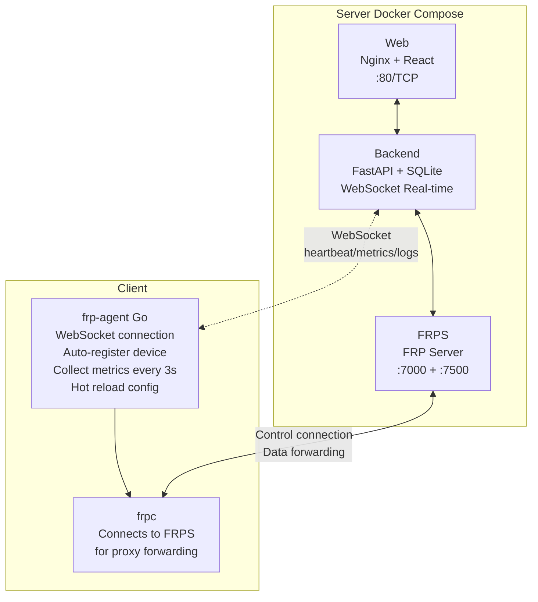

<div align="center">
  <h1>FRP-ALL-IN-ONE</h1>
  <p>A web-based FRP management system: <b>FRPS configuration</b>, <b>one-click client deployment</b>, <b>device registration/heartbeat</b>, <b>port mapping management</b>, with <b>real-time traffic monitoring</b> and <b>system resource monitoring</b>.</p>
  <p>
    <a href="https://github.com/GreenhandTan/FRP-ALL-IN-ONE/stargazers"></a>
    <a href="LICENSE"></a>
    
    
    
    
  </p>
  <p>
    <a href="#features">Features</a> ·
    <a href="#quick-start-server">Deployment</a> ·
    <a href="#ports">Ports</a> ·
    <a href="#troubleshooting">Troubleshooting</a> ·
    <a href="#license">License</a>
  </p>
  <p>
    <a href="README.md">简体中文</a> |
    <a href="README.en.md">English</a> |
    <a href="README.zh-TW.md">繁體中文</a>
  </p>
</div>

<a id="author"></a>

## Author & Community

- Blog: https://greenhandtan.top

<a id="stars"></a>

## Star History

[](https://www.star-history.com/#GreenhandTan/FRP-ALL-IN-ONE&type=date&legend=top-left)

<a id="demo"></a>

## Demo

### Main Dashboard


### Real-time Logs


<a id="toc"></a>

## Table of Contents

- [Core Features](#features)
- [Architecture](#architecture)
- [Quick Start (Server)](#quick-start-server)
- [First-time Workflow](#first-time-workflow)
- [Ports & Security Groups](#ports)
- [Monitoring & Statistics](#monitoring)
- [Common Operations](#ops)
- [Troubleshooting](#troubleshooting)
- [Uninstall Client](#uninstall)
- [Project Structure](#layout)
- [Development & Build](#development)
- [License & Requirements](#license)

<a id="features"></a>

## Core Features

### 🚀 Deployment & Management

- **One-click Deployment**: Start management backend, web, and FRPS with Docker Compose
- **Configuration Wizard**: Web interface for FRPS port, token, and public IP settings
- **One-click Scripts**: Auto-generate client deployment scripts (multi-arch, systemd, auto-start)

### 📊 Real-time Monitoring

- **Real-time Traffic Monitoring**: Agent collects network speed every 3 seconds, pushed via WebSocket
- **System Resource Monitoring**: Real-time display of CPU, memory, and disk usage
- **Cumulative Traffic Statistics**: Top cards show total cumulative traffic from all clients
- **Tunnel Traffic Statistics**: Each tunnel displays its own cumulative traffic

### 🔧 Agent Mechanism

- **Auto Registration**: Clients auto-report hostname, OS, architecture for device naming
- **Heartbeat Reporting**: Periodic system metrics reporting (CPU, memory, disk, network speed)
- **Hot Reload**: Hot reload configuration via FRPC Admin API without service restart
- **Real-time Logs**: WebSocket push FRPC logs to console

### 🌐 Other Features

- **WebSocket Real-time Push**: Status updates every second, no manual refresh needed
- **Internationalization**: Chinese/English language switching
- **Unified Dialogs**: Site-wide lightweight dialog components

<a id="architecture"></a>

## Architecture



<a id="quick-start-server"></a>

## Quick Start (Server)

### Prerequisites

- A server with public IP
- Docker & Docker Compose
- Port forwarding (minimum): 80/TCP, FRPS port (default 7000/TCP)

### One-click Deployment

```bash
git clone https://github.com/GreenhandTan/FRP-ALL-IN-ONE.git
cd FRP-ALL-IN-ONE/deploy

chmod +x deploy.sh
sudo ./deploy.sh
```

### Default Credentials

| Username | Password |
| -------- | -------- |
| admin    | 123456   |

> ⚠️ Please change the default password immediately after login!

### Low Memory Servers (512MB-1GB)

```bash
cd FRP-ALL-IN-ONE/deploy
chmod +x setup-swap.sh
sudo ./setup-swap.sh
sudo ./deploy.sh
```

### Data Persistence Note

The current `docker-compose.yml` does not persist the backend SQLite database. To enable persistence, add a volume mount for the backend in `deploy/docker-compose.yml`.

<a id="first-time-workflow"></a>

## First-time Workflow

### 1) Login to Dashboard

Visit: `http://<SERVER_PUBLIC_IP>`

### 2) Configure FRPS (Wizard)

In the wizard, set:

- Listen port (default 7000)
- Public IP (supports auto-detection)

### 3) Deploy Client

Download the script from the wizard "Client Script" page and run on your LAN machine:

```bash
chmod +x deploy-frpc.sh
sudo ./deploy-frpc.sh
```

### 4) Create Port Mapping

In the "Device List" on the dashboard:

1. Select device → Add mapping (TCP/UDP/HTTP/HTTPS)
2. Wait for Agent to sync and hot reload
3. Access internal service via `PUBLIC_IP:remote_port`

<a id="ports"></a>

## Ports & Security Groups

| Port                      | Protocol | Purpose                        |
| ------------------------- | -------- | ------------------------------ |
| 80                        | TCP      | Web management interface       |
| 7000 (or custom bindPort) | TCP      | frpc control connection        |
| 49152-65535               | TCP/UDP  | Recommended private port range |

> 💡 Each `remote_port` needs to be allowed in security groups for external access.

<a id="monitoring"></a>

## Monitoring & Statistics

### Data Refresh Frequency

| Component                       | Refresh Rate             |
| ------------------------------- | ------------------------ |
| Agent system metrics collection | Every 3 seconds          |
| WebSocket push to frontend      | Every 1 second           |
| Frontend UI update              | Real-time (event-driven) |

### Traffic Statistics Scope

| Metric                       | Description                                                                         |
| ---------------------------- | ----------------------------------------------------------------------------------- |
| Top "Total Traffic"          | Machine-level cumulative traffic from all clients (includes all network traffic)    |
| Client Card "In/Out Traffic" | Real-time network speed for that client (B/s, KB/s, MB/s)                           |
| Tunnel "Total Traffic"       | Cumulative traffic for that tunnel (from FRPS API, updated after connection closes) |

### Online Status Detection

- Agent heartbeat `last_seen` within 30 seconds is considered online
- WebSocket connection status displayed in real-time

<a id="ops"></a>

## Common Operations

### Server (Docker)

```bash
cd FRP-ALL-IN-ONE/deploy

# Check status
docker-compose ps
docker-compose logs -f

# Restart services
docker-compose restart
docker restart frps

# Rebuild
docker-compose down
docker-compose up -d --build
```

### Client

```bash
# frp-agent status
systemctl status frp-agent --no-pager
journalctl -u frp-agent -n 200 --no-pager
```

<a id="troubleshooting"></a>

## Troubleshooting

### Port Mapping Created but Cannot Access

1. **Check external connectivity** (test from a machine other than the server)

   ```bash
   nc -vz <PUBLIC_IP> <remote_port>
   ```

2. **Check security groups/firewall**: Ensure port is allowed

3. **Check if FRPS is listening**

   ```bash
   ss -lntp | grep :<remote_port>
   docker logs frps --tail 200
   ```

4. **Check client config sync**
   ```bash
   grep -n "<remote_port>" /opt/frp/frpc.toml
   journalctl -u frp-agent -n 200 --no-pager
   ```

### Device Cannot Register / Not Showing

```bash
systemctl status frp-agent --no-pager
cat /opt/frp/agent.json
```

Ensure Agent service is running properly and can connect to the management server.

<a id="uninstall"></a>

## Uninstall Client

```bash
cd FRP-ALL-IN-ONE/deploy
chmod +x uninstall-frpc.sh
sudo ./uninstall-frpc.sh
```

<a id="layout"></a>

## Project Structure

```
FRP-ALL-IN-ONE/
├── agent/                 # Client Agent (Go)
│   ├── cmd/frp-agent/     # Main entry point
│   └── internal/          # Internal modules
│       ├── config/        # Configuration management
│       ├── frpc/          # FRPC process management
│       ├── logger/        # Log collection
│       ├── monitor/       # System monitoring (CPU/memory/disk/network)
│       └── ws/            # WebSocket client
├── server/                # Backend API (FastAPI + SQLite)
├── frontend/              # Web interface (React + Vite + TailwindCSS)
├── deploy/                # Deployment scripts & docker-compose
├── demo.png               # Demo screenshot
└── demo-logs.png          # Logs feature screenshot
```

<a id="development"></a>

## Development & Build

### Frontend

```bash
cd frontend
npm install
npm run dev
```

### Agent

```bash
cd agent
go build -o frp-agent ./cmd/frp-agent
```

### Backend

Backend runs most stably via Docker; for local development, refer to the `server/` directory.

<a id="license"></a>

## License & Requirements

This project is licensed under the **MIT License** (see [LICENSE](LICENSE)).

You can:

- Free use (personal/organizational)
- Free commercial use
- Modify, redistribute, and create derivative works

You must:

- Retain license and copyright notice
- Attribute original author as **GreenhandTan**

## 🛡️ Security Recommendations

- ✅ Change default password immediately after first login
- ✅ Use strong passwords (at least 12 characters)
- ✅ Regularly update Docker images
- ✅ Only open necessary ports in security groups
- ✅ FRPS Dashboard (7500) should only allow localhost access

## 🙏 Acknowledgements

- [FRP](https://github.com/fatedier/frp) - Excellent reverse proxy tool
- [gopsutil](https://github.com/shirou/gopsutil) - Go system monitoring library

---

**⭐ If this project helps you, please give us a Star!**
