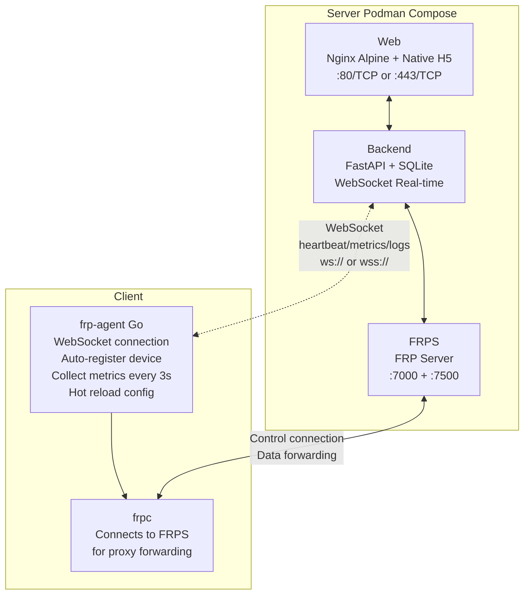

<div align="center">
  <h1>FRP-ALL-IN-ONE</h1>
  <p>A web-based FRP management system: <b>FRPS configuration</b>, <b>one-click client deployment</b>, <b>device registration/heartbeat</b>, <b>port mapping management</b>, with <b>real-time traffic monitoring</b> and <b>system resource monitoring</b>.</p>
  <p><b>🪶 Ultra Lightweight &middot; ⚡ Ready to Use &middot; 🔥 Feature-Rich</b></p>
  <p>
    <a href="https://github.com/GreenhandTan/FRP-ALL-IN-ONE/stargazers"></a>
    <a href="LICENSE"></a>
    
    
    
    
  </p>
  <p>
    <a href="#highlights">Highlights</a> ·
    <a href="#features">Features</a> ·
    <a href="#quick-start-server">Deployment</a> ·
    <a href="#ports">Ports</a> ·
    <a href="#troubleshooting">Troubleshooting</a> ·
    <a href="#license">License</a>
  </p>
  <p>
    <a href="README.md">简体中文</a> |
    <a href="README.en.md">English</a> |
    <a href="README.zh-TW.md">繁體中文</a>
  </p>
</div>

<a id="author"></a>

## Author & Community

- Blog: https://greenhandtan.top

<a id="stars"></a>

## Star History

[](https://www.star-history.com/#GreenhandTan/FRP-ALL-IN-ONE&type=date&legend=top-left)

<a id="demo"></a>

## Demo

### Main Dashboard


### Real-time Logs


<a id="toc"></a>

## Table of Contents

- [Core Highlights](#highlights)
- [Core Features](#features)
- [Architecture](#architecture)
- [Quick Start (Server)](#quick-start-server)
- [First-time Workflow](#first-time-workflow)
- [HTTPS Configuration (Optional)](#https-setup)
- [Ports & Security Groups](#ports)
- [Monitoring & Statistics](#monitoring)
- [Common Operations](#ops)
- [Troubleshooting](#troubleshooting)
- [Uninstall Client](#uninstall)
- [Project Structure](#layout)
- [Development & Build](#development)
- [License & Requirements](#license)

<a id="highlights"></a>

## Core Highlights

### 🪶 Ultra Lightweight

- **Runs smoothly on 1 vCPU + 1 GB RAM**: Tested and verified — the minimum spec cloud server is fully sufficient for deployment and daily operation
- **Zero build-tool frontend**: The web UI is written in pure native H5 + CSS + JS. No Node.js, no `npm install`, no build pipeline — browsers load it directly
- **Minimal backend stack**: FastAPI + SQLite — no MySQL/PostgreSQL needed, database files stay just a few MBs, ultra-low disk and memory footprint
- **Tiny containers**: Nginx Alpine image serving pure static files — the web container uses < 10 MB of memory

### ⚡ Ready to Use

- **Full deployment in one command**: `git clone` + run `deploy.sh` — handles dependency installation, container build, and service startup automatically
- **Visual setup wizard**: Complete FRPS configuration (IP direct or domain mode) through the web wizard on first login — no manual config file editing required
- **Auto-generated client scripts**: One click generates deployment scripts for any platform (Linux/macOS/Windows) and architecture (x86/ARM/MIPS), ready to paste and run on LAN machines

### 🔥 Feature-Rich

- **WebSocket real-time push**: Pushes global status every second — CPU/memory/disk/network metrics for every client visible in real time, no manual refresh needed
- **Hot reload**: Dynamically add/remove port mappings via FRPC Admin API; changes take effect immediately without restarting frpc
- **Fully automated HTTPS**: One-click Let's Encrypt certificate issuance in domain mode with automatic renewal (30 days before expiry); custom certificate upload also supported
- **Multi-arch Agent**: frp-agent written in Go supports x86_64 / ARM64 / ARMv7 / MIPS — covers Raspberry Pi, routers, and more
- **Production-grade security**: JWT authentication, API rate limiting, forced first-login password change, password strength validation

---

<a id="features"></a>

## Core Features

### 🚀 Deployment & Management

- **One-click Deployment**: Start management backend, web, and FRPS with Podman Compose
- **Configuration Wizard**: Web interface for FRPS port, token, and public IP settings
- **One-click Scripts**: Auto-generate client deployment scripts (multi-arch, systemd, auto-start)
- **HTTPS Automation**: Support for auto-issuing Let's Encrypt certificates or uploading custom certificates

### 🔐 Security Enhancements

- **Mandatory Password Change**: First login requires password change with strength validation (8+ chars, upper/lower case, numbers)
- **JWT Security**: Auto-generate strong keys with persistence, environment variable override support
- **API Rate Limiting**: 5 requests/minute for login, 3 requests/hour for certificate issuance, preventing brute force attacks
- **Auto Certificate Renewal**: Let's Encrypt certificates automatically renew 30 days before expiration

### 📊 Real-time Monitoring

- **Real-time Traffic Monitoring**: Agent collects network speed every 3 seconds, pushed via WebSocket
- **System Resource Monitoring**: Real-time display of CPU, memory, and disk usage
- **Cumulative Traffic Statistics**: Top cards show total cumulative traffic from all clients
- **Tunnel Traffic Statistics**: Each tunnel displays its own cumulative traffic

### 🔧 Agent Mechanism

- **Auto Registration**: Clients auto-report hostname, OS, architecture for device naming
- **Heartbeat Reporting**: Periodic system metrics reporting (CPU, memory, disk, network speed)
- **Hot Reload**: Hot reload configuration via FRPC Admin API without service restart
- **Real-time Logs**: WebSocket push FRPC logs to console
- **Protocol Adaptation**: Agent automatically detects server protocol (ws/wss) and switches

### 🌐 Other Features

- **WebSocket Real-time Push**: Status updates every second, no manual refresh needed
- **Internationalization**: Chinese/English/Traditional Chinese language switching
- **Native H5 Frontend**: No build-tool dependencies, deploy static files directly, minimal maintenance
- **Data Persistence**: SQLite database and certificates automatically persisted to Podman volumes

<a id="architecture"></a>

## Architecture


```mermaid
flowchart TB
    subgraph Server["Server Podman Compose"]
        Web["Web<br/>Nginx Alpine + Native H5<br/>:80/TCP or :443/TCP"]
        Backend["Backend<br/>FastAPI + SQLite<br/>WebSocket Real-time"]
        FRPS["FRPS<br/>FRP Server<br/>:7000 + :7500"]
        Web <--> Backend
        Backend <--> FRPS
    end

    subgraph Client["Client"]
        Agent["frp-agent Go<br/>WebSocket connection<br/>Auto-register device<br/>Collect metrics every 3s<br/>Hot reload config"]
        FRPC["frpc<br/>Connects to FRPS<br/>for proxy forwarding"]
        Agent --> FRPC
    end

    Backend <-.->|"WebSocket<br/>heartbeat/metrics/logs<br/>ws:// or wss://"| Agent
    FRPS <-->|"Control connection<br/>Data forwarding"| FRPC
```

<a id="quick-start-server"></a>

## Quick Start (Server)

### Prerequisites

- A server with public IP (**Linux recommended, minimum 1 vCPU + 1 GB RAM verified by real-world testing**)
- Podman & Podman Compose (auto-installed by deploy script)
- Port forwarding (minimum): 80/TCP, FRPS port (default 7000/TCP)

> 💡 **System Recommendation**: This project is deployed via Podman. The deployment script auto-detects Linux distributions (including Alpine, Debian/Ubuntu, and RHEL-family) and installs dependencies automatically. Windows and macOS can run as client machines; Linux is recommended for the server.

> 🪶 **Lightweight Note**: The frontend is pure native H5 static files — the Nginx container uses < 10 MB of memory. The FastAPI + SQLite backend means the entire system runs comfortably on a 1 vCPU + 1 GB server.

### One-click Deployment

```bash
git clone https://github.com/GreenhandTan/FRP-ALL-IN-ONE.git
cd FRP-ALL-IN-ONE/deploy

chmod +x deploy.sh
sudo ./deploy.sh
```

### Default Credentials

| Username | Password |
| -------- | -------- |
| admin    | 123456   |

> ⚠️ **The system enforces password change on first login**. Password must be at least 8 characters with uppercase, lowercase letters and numbers.

### Low Memory Servers (512 MB or less)

If your server has less than 1 GB of RAM, enable Swap before deploying:

```bash
cd FRP-ALL-IN-ONE/deploy
chmod +x setup-swap.sh
sudo ./setup-swap.sh   # creates 2 GB Swap
sudo ./deploy.sh
```

> 💡 A 1 vCPU + 1 GB server can typically deploy directly without Swap.

### Data Persistence

The current `compose.yml` has data persistence enabled by default:

- `frp-data`: FRP configuration file persistence
- `frp-certs`: SSL certificate persistence
- `./data`: SQLite database persistence

<a id="first-time-workflow"></a>

## First-time Workflow

### 1) Login to Dashboard

Visit: `http://<SERVER_PUBLIC_IP>`

After logging in with default credentials, the system will **enforce password change**.

### 2) Configure FRPS (Wizard)

In the wizard, set:

- Listen port (default 7000)
- Public IP (supports auto-detection)

### 3) Deploy Client

Download the script from the wizard "Client Script" page and run on your LAN machine:

```bash
chmod +x deploy-frpc.sh
sudo ./deploy-frpc.sh
```

### 4) Create Port Mapping

In the "Device List" on the dashboard:

1. Select device → Add mapping (TCP/UDP/HTTP/HTTPS)
2. Wait for Agent to sync and hot reload
3. Access internal service via `PUBLIC_IP:remote_port`

<a id="https-setup"></a>

## HTTPS Configuration (Optional)

The system supports two HTTPS activation methods:

### Method 1: Auto-issue Let's Encrypt Certificate (Recommended)

1. Go to "System Settings → Domain & HTTPS"
2. Enter your domain (e.g., `frp.example.com`)
3. Follow the prompt to point domain A record to server's public IP
4. Click "Check DNS" to verify resolution
5. Click "Enable HTTPS", the system will automatically:
   - Apply for Let's Encrypt certificate
   - Configure Nginx
   - Reload services
6. Auto-redirect to `https://your-domain`

> 🔒 **Auto Renewal**: Certificates will be automatically renewed 30 days before expiration, no manual intervention needed.

### Method 2: Upload Custom Certificate

1. Go to "System Settings → Domain & HTTPS"
2. Select "Custom Certificate" tab
3. Upload certificate file (.crt/.pem) and private key file (.key)
4. Enter domain and enable HTTPS

### Check Certificate Status

```bash
# View certificate info and expiration
curl http://localhost:8000/api/settings/tls-status
```

<a id="ports"></a>

## Ports & Security Groups

| Port                      | Protocol | Purpose                          |
| ------------------------- | -------- | -------------------------------- |
| 80                        | TCP      | Web management (HTTP)            |
| 443                       | TCP      | Web management (HTTPS, optional) |
| 7000 (or custom bindPort) | TCP      | frpc control connection          |
| 49152-65535               | TCP/UDP  | Recommended private port range   |

> 💡 Each `remote_port` needs to be allowed in security groups for external access.

<a id="monitoring"></a>

## Monitoring & Statistics

### Data Refresh Frequency

| Component                       | Refresh Rate             |
| ------------------------------- | ------------------------ |
| Agent system metrics collection | Every 3 seconds          |
| WebSocket push to frontend      | Every 1 second           |
| Frontend UI update              | Real-time (event-driven) |
| FRPS status cache refresh       | Every 5 seconds          |
| Certificate renewal check       | Every 24 hours           |

### Traffic Statistics Scope

| Metric                       | Description                                                                         |
| ---------------------------- | ----------------------------------------------------------------------------------- |
| Top "Total Traffic"          | Machine-level cumulative traffic from all clients (includes all network traffic)    |
| Client Card "In/Out Traffic" | Real-time network speed for that client (B/s, KB/s, MB/s)                           |
| Tunnel "Total Traffic"       | Cumulative traffic for that tunnel (from FRPS API, updated after connection closes) |

### Online Status Detection

- Agent heartbeat `last_seen` within 30 seconds is considered online
- WebSocket connection status displayed in real-time

<a id="ops"></a>

## Common Operations

### Server (Podman)

```bash
cd FRP-ALL-IN-ONE/deploy

# Check status
podman compose -f compose.yml ps
podman compose -f compose.yml logs -f

# Restart services
podman compose -f compose.yml restart
podman restart frps

# Update to latest version
podman compose -f compose.yml down
git pull
podman compose -f compose.yml up -d --build

# View certificate renewal logs
podman exec frp-manager-backend cat /var/log/acme.cron.log
```

### Client

```bash
# frp-agent status
systemctl status frp-agent --no-pager
journalctl -u frp-agent -n 200 --no-pager
```

<a id="troubleshooting"></a>

## Troubleshooting

### Port Mapping Created but Cannot Access

1. **Check external connectivity** (test from a machine other than the server)

   ```bash
   nc -vz <PUBLIC_IP> <remote_port>
   ```

2. **Check security groups/firewall**: Ensure port is allowed

3. **Check if FRPS is listening**

   ```bash
   ss -lntp | grep :<remote_port>
   podman logs frps --tail 200
   ```

4. **Check client config sync**
   ```bash
   grep -n "<remote_port>" /opt/frp/frpc.toml
   journalctl -u frp-agent -n 200 --no-pager
   ```

### Device Cannot Register / Not Showing

```bash
systemctl status frp-agent --no-pager
cat /opt/frp/agent.json
```

Ensure Agent service is running properly and can connect to the management server.

### HTTPS Certificate Application Failed

1. **Check DNS resolution**: Ensure domain A record points to server's public IP
2. **Check port 80**: Let's Encrypt validation requires temporary use of port 80
3. **View logs**: `podman logs frp-manager-backend | grep -i "cert\|acme"`
4. **Manual trigger renewal**: Click "Renew Certificate" button in Web UI

<a id="uninstall"></a>

## Uninstall Client

```bash
cd FRP-ALL-IN-ONE/deploy
chmod +x uninstall-frpc.sh
sudo ./uninstall-frpc.sh
```

<a id="layout"></a>

## Project Structure

```
FRP-ALL-IN-ONE/
├── agent/                 # Client Agent (Go)
│   ├── cmd/frp-agent/     # Main entry point
│   └── internal/          # Internal modules
│       ├── config/        # Configuration management
│       ├── frpc/          # FRPC process management
│       ├── logger/        # Log collection
│       ├── monitor/       # System monitoring (CPU/memory/disk/network)
│       └── ws/            # WebSocket client
├── server/                # Backend API (FastAPI + SQLite)
│   ├── core/              # Core infrastructure
│   │   ├── dependencies.py    # Dependency injection (auth, database)
│   │   ├── exceptions.py      # Unified exception handling
│   │   └── rate_limit.py      # API rate limiting
│   ├── routers/           # API routes
│   │   ├── auth.py            # Authentication (login, password change)
│   │   ├── clients.py         # Client, tunnel management
│   │   ├── agents.py          # Agent management, metrics
│   │   ├── frp_server.py      # FRPS management, install scripts
│   │   ├── system.py          # System status
│   │   └── settings.py        # Domain & HTTPS settings
│   └── services/          # Business logic layer
│       ├── tls_manager.py     # Certificate management, Nginx config
│       └── dns_checker.py     # DNS resolution verification
├── frontend/              # Web interface (Native H5 + CSS + JS, no build tools required)
│   ├── index.html         # Single-page app entry
│   ├── style.css          # Global styles
│   └── app.js             # All frontend logic
├── deploy/                # Deployment scripts & compose
├── demo.png               # Demo screenshot
└── demo-logs.png          # Logs feature screenshot
```

<a id="development"></a>

## Development & Build

### Frontend

The frontend is pure native H5 — **no build step required**. Just edit the three files in `frontend/`:

```
frontend/
├── index.html   # Page structure & templates
├── style.css    # Styles
└── app.js       # All interaction logic
```

For local preview, use any static file server:

```bash
cd frontend
python3 -m http.server 3000
```

### Agent

```bash
cd agent
go build -o frp-agent ./cmd/frp-agent
```

Cross-compilation examples:

```bash
# Linux ARM64 (Raspberry Pi, etc.)
GOOS=linux GOARCH=arm64 go build -o frp-agent-linux-arm64 ./cmd/frp-agent
# Linux x86_64
GOOS=linux GOARCH=amd64 go build -o frp-agent-linux-amd64 ./cmd/frp-agent
```

### Backend

Backend runs most stably via Podman; for local development:

```bash
cd server
pip install -r requirements.txt
python -m uvicorn main:app --reload
```

<a id="license"></a>

## License & Requirements

This project is licensed under the **MIT License** (see [LICENSE](LICENSE)).

You can:

- Free use (personal/organizational)
- Free commercial use
- Modify, redistribute, and create derivative works

You must:

- Retain license and copyright notice
- Attribute original author as **GreenhandTan**

## 🛡️ Security Recommendations

- ✅ Change default password immediately after first login (enforced by system)
- ✅ Use strong passwords (at least 8 characters with upper/lower case + numbers)
- ✅ Regularly update Podman images
- ✅ Only open necessary ports in security groups
- ✅ FRPS Dashboard (7500) should only allow localhost access
- ✅ Enable HTTPS to encrypt communications (recommended for production)

## 🙏 Acknowledgements

- [FRP](https://github.com/fatedier/frp) - Excellent reverse proxy tool
- [gopsutil](https://github.com/shirou/gopsutil) - Go system monitoring library
- [acme.sh](https://github.com/acmesh-official/acme.sh) - Full-featured Let's Encrypt client

---

**⭐ If this project helps you, please give us a Star!**
