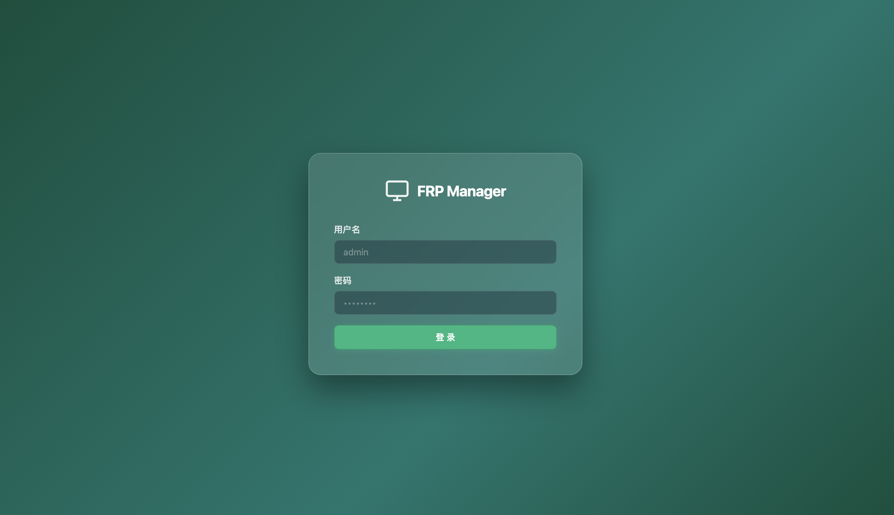
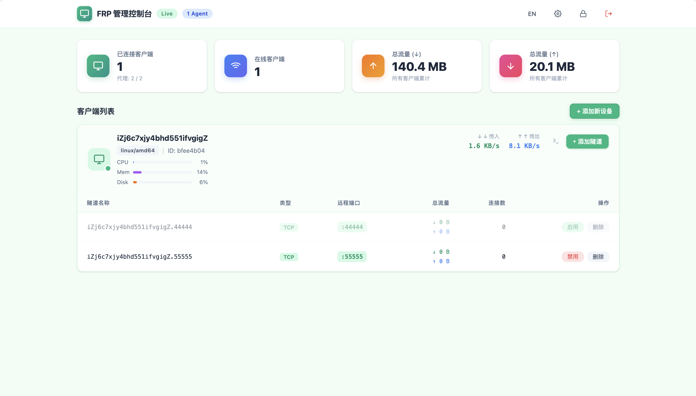
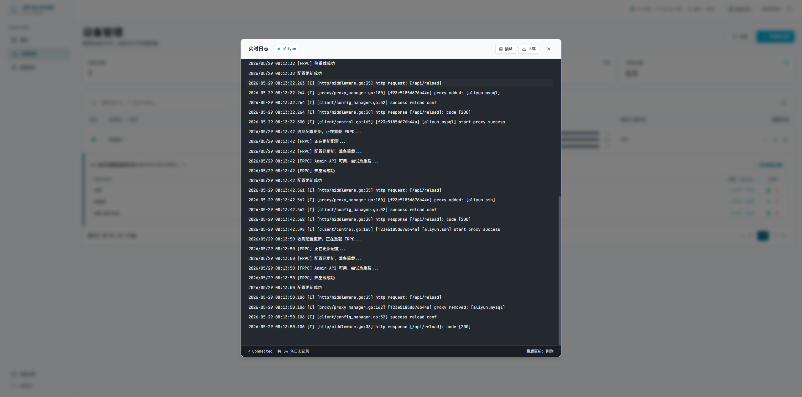
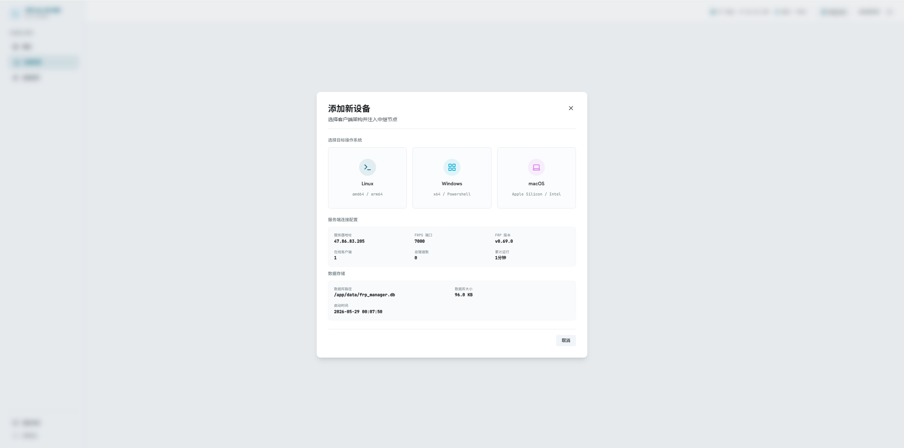
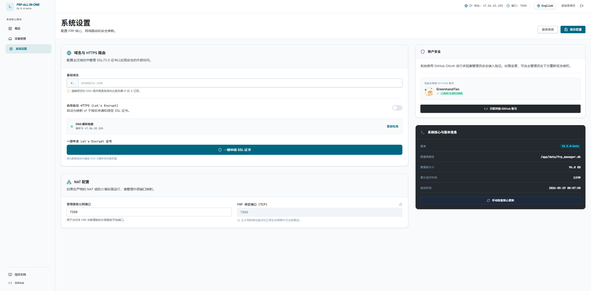
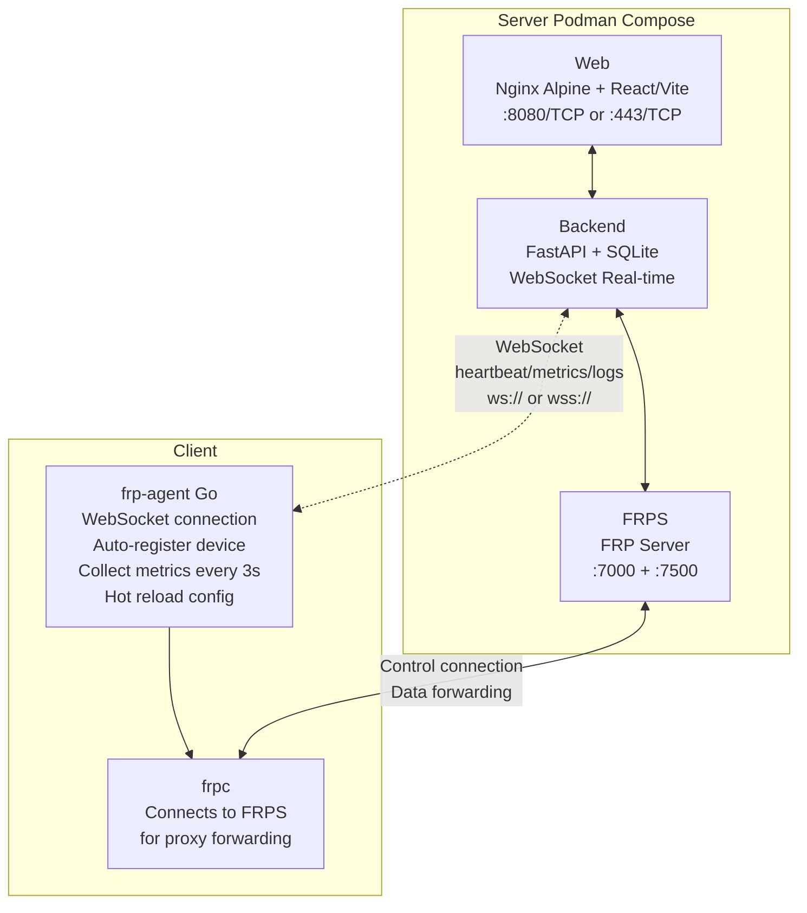

<div align="center">
  <h1>FRP-ALL-IN-ONE</h1>
  <p>A web-based FRP management system: <b>FRPS configuration</b>, <b>one-click client deployment</b>, <b>device registration/heartbeat</b>, <b>port mapping management</b>, with <b>real-time traffic monitoring</b> and <b>system resource monitoring</b>.</p>
  <p><b>Ultra Lightweight &middot; Ready to Use &middot; Feature-Rich</b></p>
  <p>
    <a href="https://github.com/GreenhandTan/FRP-ALL-IN-ONE/stargazers"></a>
    <a href="LICENSE"></a>
    
    
    
    
  </p>
  <p>
    <a href="#highlights">Highlights</a> ·
    <a href="#features">Features</a> ·
    <a href="#quick-start-server">Deployment</a> ·
    <a href="#ports">Ports</a> ·
    <a href="#troubleshooting">Troubleshooting</a> ·
    <a href="#license">License</a>
  </p>
  <p>
    <a href="README.md">简体中文</a> |
    <a href="README.en.md">English</a> |
    <a href="README.zh-TW.md">繁體中文</a>
  </p>
</div>

> [!CAUTION]
> **Upgrade Notice (V2.5.0-beta)**: Major architectural upgrade + frontend UI redesign + security hardening. **A fresh deployment is recommended** for existing users. See [Upgrade Guide](#upgrade).

<a id="author"></a>

## Author & Community

- Blog: https://greenhandtan.top

<a id="stars"></a>

## Star History

[](https://www.star-history.com/#GreenhandTan/FRP-ALL-IN-ONE&type=date&legend=top-left)

<a id="demo"></a>

## Demo


<br/><br/>

<br/><br/>

<br/><br/>

<br/><br/>


<a id="toc"></a>

## Table of Contents

- [Core Highlights](#highlights)
- [Core Features](#features)
- [Architecture](#architecture)
- [Quick Start (Server)](#quick-start-server)
- [Upgrade Guide](#upgrade)
- [First-time Workflow](#first-time-workflow)
- [HTTPS Configuration (Optional)](#https-setup)
- [NAT Access Port Configuration (Optional)](#nat-port-setup)
- [Feiniu OS Client Notes](#fnos-client)
- [Ports & Security Groups](#ports)
- [Monitoring & Statistics](#monitoring)
- [Common Operations](#ops)
- [Troubleshooting](#troubleshooting)
- [Uninstall Client](#uninstall)
- [Project Structure](#layout)
- [Development & Build](#development)
- [License & Requirements](#license)

<a id="highlights"></a>

## Core Highlights

### Ultra Lightweight

- **Runs smoothly on 1 vCPU + 1 GB RAM**: Tested and verified — the minimum spec cloud server is fully sufficient for deployment and daily operation
- **Modern frontend stack**: React 19 + TypeScript + Vite + Tailwind CSS — type-safe, fast builds, elegant styling
- **Minimal backend stack**: FastAPI + SQLite — no MySQL/PostgreSQL needed, database files stay just a few MBs, ultra-low disk and memory footprint
- **Tiny containers**: Nginx Alpine image serving pure static files — the web container uses < 10 MB of memory

> **Real-World Example: Extreme Low-Spec LXC Server**  
> Using a **local build + remote import** deployment technique (build project images locally, then transfer and import them on the cloud server to bypass memory constraints during the build phase), this project runs smoothly on an LXC-type cloud server with only **1 vCPU, 256 MB RAM, and a 2 GB data disk**, delivering full centralized FRP management. The author's test machine costs just **¥29.9 for 3 years** — exceptional value. See the detailed walkthrough: [Author's Blog #25](https://greenhandtan.top/blog/25)

### Ready to Use

- **Full deployment in one command**: `git clone` + run `deploy.sh` — handles dependency installation, container build, and service startup automatically
- **Visual setup wizard**: Complete FRPS configuration (IP direct or domain mode) through the web wizard on first login — no manual config file editing required
- **Auto-generated client scripts**: One click generates deployment scripts for any platform (Linux/macOS/Windows) and architecture (x86/ARM/MIPS), ready to paste and run on LAN machines
- **NAT Compatibility**: Supports explicit panel access port configuration for NAT environments (e.g., `PUBLIC_IP:10967 → internal port 80`), ensuring generated agent scripts always contain the correct address

### Feature-Rich

- **WebSocket real-time push**: Pushes global status every 3 seconds — CPU/memory/disk/network metrics for every client visible in real time, no manual refresh needed
- **Hot reload**: Dynamically add/remove port mappings via FRPC Admin API; changes take effect immediately without restarting frpc
- **Fully automated HTTPS**: One-click Let's Encrypt certificate issuance in domain mode with automatic renewal (30 days before expiry)
- **Multi-arch Agent**: frp-agent written in Go supports x86_64 / ARM64 / ARMv7 / MIPS — covers Raspberry Pi, routers, and more
- **Production-grade security**: GitHub OAuth authentication, JWT authorization, API rate limiting, invite-based access control, Nginx security headers

---

<a id="features"></a>

## Core Features

### Deployment & Management

- **One-click Deployment**: Start management backend, web, and FRPS with Podman Compose
- **Configuration Wizard**: Web interface for FRPS port, token, and public IP settings
- **One-click Scripts**: Auto-generate client deployment scripts (multi-arch, systemd / OpenRC / launchd, auto-start)
- **HTTPS Automation**: One-click Let's Encrypt certificate issuance with automatic renewal
- **NAT Port Config**: Support explicit panel access port for NAT cloud servers, scripts auto-use correct address

### Security Enhancements

- **GitHub OAuth Authentication**: Login with GitHub account; no bundled credentials — users provide their own OAuth App
- **Invite-based Access Control**: First login user auto-becomes superadmin; subsequent users must be invited
- **Admin Management**: Superadmin can invite/remove GitHub users and manage admin list from the console
- **Advanced JWT Protection**: Stateless Ephemeral JWT Keys in memory (prevents DB leak), supports `SECRET_KEY` env var for multi-node
- **Network Isolation**: Backend bound to 127.0.0.1, strict regex validation blocks Nginx config injection
- **API Rate Limiting**: Login: 5 req/min; certificate: 3 req/hour
- **Security Headers**: Nginx adds `X-Content-Type-Options`, `X-Frame-Options`, `Referrer-Policy`
- **Smart Certificate Management**: Auto-renew Let's Encrypt certs via async Python tasks, console shows expiry and manual renewal

### Real-time Monitoring

- **Real-time Traffic Monitoring**: Agent collects network speed every 3 seconds, pushed via WebSocket
- **System Resource Monitoring**: Real-time display of CPU, memory, and disk usage
- **Cumulative Traffic Statistics**: Top cards show total cumulative traffic from all clients
- **Tunnel Traffic Statistics**: Each tunnel displays its own cumulative traffic

### Agent Mechanism

- **Auto Registration**: Clients auto-report hostname, OS, architecture for device naming
- **Heartbeat Reporting**: Periodic system metrics reporting (CPU, memory, disk, network speed)
- **Hot Reload**: Hot reload configuration via FRPC Admin API without service restart
- **Real-time Logs**: WebSocket push FRPC logs to console
- **Protocol Adaptation**: Agent automatically detects server protocol (ws/wss) and switches

### Other Features

- **WebSocket Real-time Push**: Status updates every 3 seconds, no manual refresh needed
- **Internationalization**: Chinese/English/Traditional Chinese language switching
- **Modern Frontend**: React + TypeScript + Vite, type-safe with instant hot reload
- **Data Persistence**: SQLite database and certificates automatically persisted to Podman volumes

<a id="architecture"></a>

## Architecture


```mermaid
flowchart TB
    subgraph Server["Server Podman Compose"]
        Web["Web<br/>Nginx Alpine + React/Vite<br/>:8080/TCP or :443/TCP"]
        Backend["Backend<br/>FastAPI + SQLite<br/>WebSocket Real-time"]
        FRPS["FRPS<br/>FRP Server<br/>:7000 + :7500"]
        Web <--> Backend
        Backend <--> FRPS
    end

    subgraph Client["Client"]
        Agent["frp-agent Go<br/>WebSocket connection<br/>Auto-register device<br/>Collect metrics every 3s<br/>Hot reload config"]
        FRPC["frpc<br/>Connects to FRPS<br/>for proxy forwarding"]
        Agent --> FRPC
    end

    Backend <-.->|"WebSocket<br/>heartbeat/metrics/logs<br/>ws:// or wss://"| Agent
    FRPS <-->|"Control connection<br/>Data forwarding"| FRPC
```

<a id="quick-start-server"></a>

## Quick Start (Server)

### Prerequisites

- A server with public IP (**Linux recommended, minimum 1 vCPU + 1 GB RAM verified by real-world testing**)
- Podman & Podman Compose (auto-installed by deploy script)
- Port forwarding (minimum): 8080/TCP, FRPS port (default 7000/TCP)
- A GitHub account (for login and creating OAuth App)

> **System Recommendation**: This project is deployed via Podman. The deployment script auto-detects Linux distributions (including Alpine, Debian/Ubuntu, and RHEL-family) and installs dependencies automatically. Windows and macOS can run as client machines; Linux is recommended for the server.

> **Lightweight Note**: The frontend is React-built static files served by Nginx — the web container uses < 10 MB of memory. The FastAPI + SQLite backend means the entire system runs comfortably on a 1 vCPU + 1 GB server.

### Create GitHub OAuth App (Required)

This system uses GitHub OAuth for authentication. You need to create your own GitHub OAuth App:

1. Go to https://github.com/settings/developers
2. Click **New OAuth App**
3. Fill in:
   - **Application name**: `FRP Manager` (or any name)
   - **Homepage URL**: `http://<your-server-ip>:8080` (or your domain)
   - **Authorization callback URL**: `http://<your-server-ip>:8080/api/auth/github/callback`
4. Click **Register application**
5. Copy the **Client ID**
6. Click **Generate a new client secret**, copy the **Client Secret**

Then set environment variables before deploying:

```bash
export GITHUB_CLIENT_ID="your-client-id"
export GITHUB_CLIENT_SECRET="your-client-secret"
```

Or create a `.env` file in the same directory as `compose.yml`:

```env
GITHUB_CLIENT_ID=your-client-id
GITHUB_CLIENT_SECRET=your-client-secret
```

> **Security Note**: The system does not bundle any GitHub credentials. Each user must provide their own OAuth App information.

### One-click Deployment

```bash
git clone https://github.com/GreenhandTan/FRP-ALL-IN-ONE.git
cd FRP-ALL-IN-ONE/deploy

chmod +x deploy.sh
sudo ./deploy.sh
```

### First Login

After deployment, visit `http://<your-server-ip>:8080` and click **Sign in with GitHub**.

**The first GitHub user to log in will automatically become the superadmin.** After that, only invited GitHub users can log in.

The superadmin can invite other GitHub users from the "Admin Management" panel in the console.

### Low Memory Servers (512 MB or less)

If your server has less than 1 GB of RAM, enable Swap before deploying:

```bash
cd FRP-ALL-IN-ONE/deploy
chmod +x setup-swap.sh
sudo ./setup-swap.sh   # creates 2 GB Swap
sudo ./deploy.sh
```

> A 1 vCPU + 1 GB server can typically deploy directly without Swap.

### Data Persistence

The current `compose.yml` has data persistence enabled by default:

- `frp-data`: FRP configuration file persistence
- `frp-certs`: SSL certificate persistence
- `./data`: SQLite database persistence

<a id="upgrade"></a>

## Upgrade Guide

> [!CAUTION]
> **V2.5.0-beta is a major architectural upgrade** (GitHub OAuth login + frontend UI redesign + security hardening). Database schema and frontend code have breaking changes. **A fresh deployment is recommended** — no manual database migration needed.

### Fresh Deployment (Recommended)

```bash
cd FRP-ALL-IN-ONE/deploy
podman compose -f compose.yml down
cd ..
mv deploy/data deploy/data.bak   # Optional: backup old data
git pull
cd deploy
sudo ./deploy.sh
```

> To preserve old data, back up the `deploy/data` directory before redeploying. The first GitHub user to log in will automatically become superadmin.

<a id="first-time-workflow"></a>

## First-time Workflow

### 1) Login to Dashboard

Visit `http://<SERVER_PUBLIC_IP>:8080` and click **Sign in with GitHub**.

**The first GitHub user to log in will automatically become the superadmin.** After that, only invited GitHub users can log in. The superadmin can invite other GitHub users from the "Admin Management" panel.

### 2) Configure FRPS (Wizard)

In the wizard, set:

- Listen port (default 7000)
- Public IP (supports auto-detection)

### 3) Deploy Client

Download the script from the wizard "Client Script" page and run on your LAN machine:

```bash
chmod +x deploy-frpc.sh
sudo ./deploy-frpc.sh
```

### 4) Create Port Mapping

In the "Device List" on the dashboard:

1. Select device → Add mapping (TCP/UDP/HTTP/HTTPS)
2. Wait for Agent to sync and hot reload
3. Access internal service via `PUBLIC_IP:remote_port`

<a id="https-setup"></a>

## HTTPS Configuration (Optional)

1. Go to "System Settings → Domain & HTTPS"
2. Enter your domain (e.g., `frp.example.com`)
3. Follow the prompt to point domain A record to server's public IP
4. Click "Check DNS" to verify resolution
5. Click "Enable HTTPS", the system will automatically:
   - Apply for Let's Encrypt certificate
   - Configure Nginx
   - Reload services
6. Auto-redirect to `https://your-domain`

> **Auto Renewal**: Certificates will be automatically renewed 30 days before expiration, no manual intervention needed.

<a id="nat-port-setup"></a>

## NAT Access Port Configuration (Optional)

> **Use Case**: Your cloud server accesses the management panel through a NAT port mapping rather than a direct public IP, for example:
> `Public 151.242.85.89:10967` → `Internal server:8080` (panel accessed via NAT)

In this scenario, without extra configuration the generated client install scripts will lack the port number (defaulting to 80), causing Agents to fail connecting to the management panel.

### How to Configure

1. Log in to the management console and click the **gear icon** (⚙) in the top-right navbar
2. Enter the NAT-mapped public port in the "Panel Access Port" field (e.g., `10967`)
3. Click **Save**

Once saved, all subsequently generated client install scripts will automatically use:

```
ws://151.242.85.89:10967/ws/agent/<CLIENT_ID>
```

### Address Resolution Priority

The `MANAGER_WS_URL` in generated scripts is determined by the following priority:

| Priority   | Condition                                     | Address Used                      |
| ---------- | --------------------------------------------- | --------------------------------- |
| ① Highest  | NAT port explicitly configured in settings    | `ws://PUBLIC_IP:NAT_PORT`         |
| ②          | Browser request carries Host header with port | `ws://host:port from Host header` |
| ③          | HTTPS enabled + domain configured             | `wss://domain`                    |
| ④ Fallback | Otherwise                                     | `ws://PUBLIC_IP`                  |

> **Normal cloud servers**: No configuration needed. Leave blank and the system uses the public IP automatically.

<a id="fnos-client"></a>

## Feiniu OS Client Notes

Yes, but you need to distinguish between “the Agent binary can run” and “the current one-click install script works out of the box”.

- **Client deployment is generally possible**: Feiniu OS is still a Linux-based environment, so the Linux Agent can usually run as long as the device architecture is `x86_64` or `arm64`.
- **The current one-click script supports multiple init systems**: auto-detects systemd (mainstream distros), OpenRC (Alpine, etc.), and falls back to nohup background process when no init system is available.
- **If Feiniu OS provides a standard Linux userspace**: you can usually deploy with the generated Linux client script directly.
- **If Feiniu OS does not use systemd/OpenRC or restricts system services**: the script automatically falls back to nohup background mode — the Agent and frpc will still work normally.

Recommended checks on Feiniu OS:

```bash
uname -m
command -v systemctl || command -v rc-update
command -v curl
command -v wget
test -w /opt || sudo test -w /opt
```

Quick interpretation:

- `x86_64` or `aarch64`: architecture is supported.
- `systemctl` or `rc-update` exists and `/opt` is writable: the current script will work directly.
- Neither exists: the script automatically falls back to nohup background mode.

<a id="ports"></a>

## Ports & Security Groups

| Port                      | Protocol | Purpose                          |
| ------------------------- | -------- | -------------------------------- |
| 8080                      | TCP      | Web management (HTTP)            |
| 443                       | TCP      | Web management (HTTPS, optional) |
| 7000 (or custom bindPort) | TCP      | frpc control connection          |
| 49152-65535               | TCP/UDP  | Recommended private port range   |

> Each `remote_port` needs to be allowed in security groups for external access.

<a id="monitoring"></a>

## Monitoring & Statistics

### Data Refresh Frequency

| Component                       | Refresh Rate                      |
| ------------------------------- | --------------------------------- |
| Agent system metrics collection | Every 3 seconds                   |
| WebSocket push to frontend      | Every 3 seconds (per agent cycle) |
| Frontend real-time speed update | Instant on each message           |
| Frontend CPU/Memory/Disk        | Every 3rd message                 |
| FRPS status cache refresh       | Every 10 seconds                  |
| Certificate renewal check       | Every 24 hours                    |

### Traffic Statistics Scope

| Metric                       | Description                                                                         |
| ---------------------------- | ----------------------------------------------------------------------------------- |
| Top "Total Traffic"          | Machine-level cumulative traffic from all clients (includes all network traffic)    |
| Client Card "In/Out Traffic" | Real-time network speed for that client (B/s, KB/s, MB/s)                           |
| Tunnel "Total Traffic"       | Cumulative traffic for that tunnel (from FRPS API, updated after connection closes) |

### Online Status Detection

- Agent heartbeat `last_seen` within 30 seconds is considered online
- WebSocket connection status displayed in real-time

<a id="ops"></a>

## Common Operations

### Server (Podman)

```bash
cd FRP-ALL-IN-ONE/deploy

# Check status
podman compose -f compose.yml ps
podman compose -f compose.yml logs -f

# Restart services
podman compose -f compose.yml restart
podman restart frps

# Update to latest version (pull pre-built images from TCR)
podman compose -f compose.yml down
podman compose -f compose.yml pull
podman compose -f compose.yml up -d

# View certificate renewal logs
podman exec frp-manager-backend cat /var/log/acme.cron.log
```

### Client

**Linux (systemd)**:

```bash
systemctl status frp-agent --no-pager
journalctl -u frp-agent -n 200 --no-pager
```

**Linux (OpenRC / Alpine)**:

```bash
rc-service frp-agent status
cat /opt/frp/logs/*.log
```

**macOS (launchd)**:

```bash
launchctl list | grep frp-agent
cat /opt/frp/logs/*.log
```

<a id="troubleshooting"></a>

## Troubleshooting

### Port Mapping Created but Cannot Access

1. **Check external connectivity** (test from a machine other than the server)

   ```bash
   nc -vz <PUBLIC_IP> <remote_port>
   ```

2. **Check security groups/firewall**: Ensure port is allowed

3. **Check if FRPS is listening**

   ```bash
   ss -lntp | grep :<remote_port>
   podman logs frps --tail 200
   ```

4. **Check client config sync**
   ```bash
   grep -n "<remote_port>" /opt/frp/frpc.toml
   journalctl -u frp-agent -n 200 --no-pager
   ```

### Device Cannot Register / Not Showing

```bash
systemctl status frp-agent --no-pager
cat /opt/frp/agent.json
```

Ensure Agent service is running properly and can connect to the management server.

### HTTPS Certificate Application Failed

1. **Check DNS resolution**: Ensure domain A record points to server's public IP
2. **Check port 8080**: Let's Encrypt validation requires use of port 8080
3. **View logs**: `podman logs frp-manager-backend | grep -i "cert\|acme"`
4. **Manual trigger renewal**: Click "Renew Certificate" button in Web UI

<a id="uninstall"></a>

## Uninstall Client

```bash
cd FRP-ALL-IN-ONE/deploy
chmod +x uninstall-frpc.sh
sudo ./uninstall-frpc.sh
```

<a id="layout"></a>

## Project Structure

```
FRP-ALL-IN-ONE/
├── frontend/               # Web UI (React + TypeScript + Vite + Tailwind CSS)
│   ├── src/
│   │   ├── App.tsx         # Main application component (routes, pages, state)
│   │   ├── api.ts          # HTTP API module (REST API client)
│   │   ├── ws.ts           # WebSocket module (real-time data push)
│   │   ├── types.ts        # TypeScript type definitions
│   │   ├── data.ts         # Static data & script generation
│   │   └── index.css       # Global styles (Tailwind CSS)
│   ├── Dockerfile          # Multi-stage build: Node compile + Nginx deploy
│   ├── package.json
│   └── vite.config.ts
├── server/                # Backend API (FastAPI + SQLite)
│   ├── main.py             # App entry, WebSocket endpoints
│   ├── auth.py             # JWT auth & GitHub OAuth
│   ├── models.py           # Database models
│   ├── schemas.py          # Pydantic validation
│   ├── crud.py             # Database CRUD operations
│   ├── database.py         # SQLite connection
│   ├── frp_deploy.py       # FRPS deployment & config generation
│   ├── websocket_manager.py # WebSocket connection manager
│   ├── core/               # Core infrastructure
│   │   ├── dependencies.py    # Dependency injection (auth, database)
│   │   ├── container_engine.py # Podman container engine
│   │   ├── rate_limit.py      # API rate limiting
│   │   └── exceptions.py      # Unified exception handling
│   ├── routers/            # API routes
│   │   ├── auth.py            # Authentication (GitHub OAuth, admin management)
│   │   ├── clients.py         # Client & tunnel management
│   │   ├── agents.py          # Agent management & metrics
│   │   ├── frp_server.py      # FRPS management & install scripts
│   │   ├── system.py          # System status
│   │   └── settings.py        # Domain & HTTPS settings
│   └── services/           # Business logic layer
│       ├── dashboard.py       # Dashboard data aggregation
│       ├── tls_manager.py     # Certificate management & Nginx config
│       └── dns_checker.py     # DNS resolution verification
├── agent/                  # Client Agent (Go)
│   ├── cmd/frp-agent/      # Main entry point
│   ├── internal/           # Internal modules
│   │   ├── config/         #   Configuration management
│   │   ├── frpc/           #   FRPC process management
│   │   ├── monitor/        #   System monitoring (CPU/memory/disk/network)
│   │   ├── ws/             #   WebSocket client
│   │   └── logger/         #   Log collection
│   ├── scripts/            # Install script templates
│   ├── go.mod
│   └── Makefile
├── deploy/                 # Deployment scripts & compose
│   ├── compose.yml         # Podman Compose (3 containers)
│   ├── deploy.sh           # One-click server deploy script
│   ├── frps.toml           # FRPS config template
│   ├── setup-swap.sh       # Swap/zram setup for low-memory VPS
│   └── uninstall-frpc.sh   # Client uninstall script
├── .github/workflows/      # CI/CD
│   ├── build-and-push.yml  #   Build & push Docker images to TCR
│   └── release-agent.yml   #   Build & release Agent to GitHub Releases
├── demo1.png               # Demo screenshot 1
├── demo2.png               # Demo screenshot 2
├── demo3.png               # Demo screenshot 3
├── demo4.png               # Demo screenshot 4
└── demo5.png               # Demo screenshot 5
```

<a id="development"></a>

## Development & Build

### Frontend

The frontend is built with React + TypeScript + Vite + Tailwind CSS, requiring Node.js:

```bash
cd frontend
npm install
npm run dev     # Dev server at http://localhost:3000
npm run build   # Build production to dist/
npm run lint    # TypeScript type check
```

### Agent

```bash
cd agent
make dev            # Build for current platform
make all            # Build all platforms (output in dist/)
```

Linux builds use `CGO_ENABLED=0` for static linking, compatible with both Alpine (musl) and standard distros (glibc):

```bash
# Linux ARM64 (Raspberry Pi, etc.)
CGO_ENABLED=0 GOOS=linux GOARCH=arm64 go build -o frp-agent-linux-arm64 ./cmd/frp-agent
# Linux x86_64
CGO_ENABLED=0 GOOS=linux GOARCH=amd64 go build -o frp-agent-linux-amd64 ./cmd/frp-agent
```

### Backend

Backend runs most stably via Podman; for local development:

```bash
cd server
pip install -r requirements.txt
python -m uvicorn main:app --reload
```

<a id="license"></a>

## License & Requirements

This project is licensed under the **MIT License** (see [LICENSE](LICENSE)).

You can:

- Free use (personal/organizational)
- Free commercial use
- Modify, redistribute, and create derivative works

You must:

- Retain license and copyright notice
- Attribute original author as **GreenhandTan**

## Security Recommendations

- Promptly invite trusted GitHub users and remove admins who no longer need access
- Each redeployment automatically regenerates `SECRET_KEY`, invalidating all existing sessions
- Regularly update Podman images (host Podman version must be >= 4.0, the deploy script checks automatically)
- Only open necessary ports in security groups
- FRPS Dashboard (7500) should only allow localhost access
- Enable HTTPS to encrypt communications (recommended for production)

## Acknowledgements

- [FRP](https://github.com/fatedier/frp) - Excellent reverse proxy tool
- [gopsutil](https://github.com/shirou/gopsutil) - Go system monitoring library
- [acme.sh](https://github.com/acmesh-official/acme.sh) - Full-featured Let's Encrypt client

---

If this project helps you, a Star is welcome.
