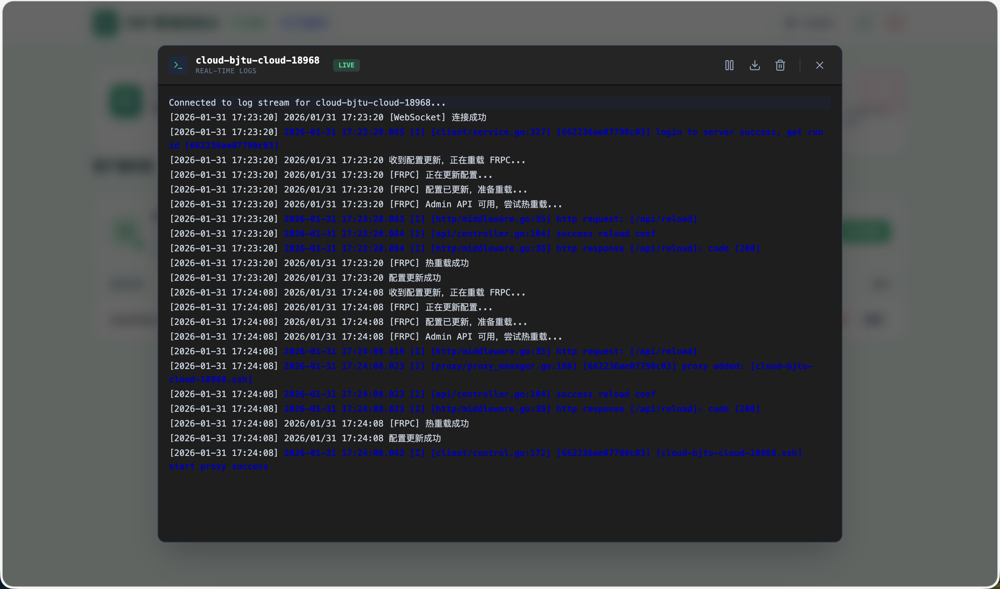
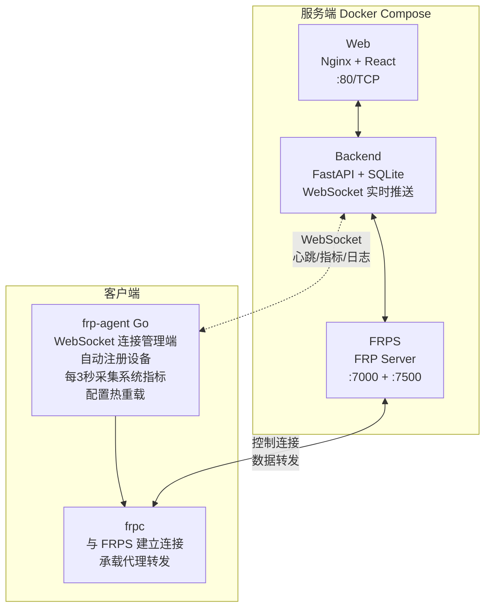

<div align="center">
  <h1>FRP-ALL-IN-ONE</h1>
  <p>一个基于 Web 的 FRP 内网穿透管理系统：用浏览器完成 <b>FRPS 配置</b>、<b>客户端一键部署</b>、<b>设备注册/心跳</b>、<b>端口映射管理</b>，并提供<b>实时流量监控</b>与<b>系统资源监控</b>。</p>
  <p>
    <a href="https://github.com/GreenhandTan/FRP-ALL-IN-ONE/stargazers"></a>
    <a href="LICENSE"></a>
    
    
    
    
  </p>
  <p>
    <a href="#features">功能特性</a> ·
    <a href="#quick-start-server">部署指南</a> ·
    <a href="#ports">端口放行</a> ·
    <a href="#troubleshooting">排障</a> ·
    <a href="#license">开源协议</a>
  </p>
  <p>
    <a href="README.md">简体中文</a> |
    <a href="README.en.md">English</a> |
    <a href="README.zh-TW.md">繁體中文</a>
  </p>
</div>

<a id="author"></a>

## 作者与社区

- 博客：https://greenhandtan.top

<a id="stars"></a>

## Star History

[](https://www.star-history.com/#GreenhandTan/FRP-ALL-IN-ONE&type=date&legend=top-left)

<a id="demo"></a>

## 效果演示

### 主控制台


### 实时日志



<a id="toc"></a>

## 目录

- [核心特性](#features)
- [架构说明](#architecture)
- [快速开始（服务端）](#quick-start-server)
- [首次使用流程](#first-time-workflow)
- [端口与安全组](#ports)
- [监控与统计说明](#monitoring)
- [常用运维命令](#ops)
- [排障指南](#troubleshooting)
- [卸载客户端](#uninstall)
- [项目结构](#layout)
- [开发与构建](#development)
- [开源协议与使用要求](#license)

<a id="features"></a>

## 核心特性

### 🚀 部署与管理

- **一键部署**：Docker Compose 启动管理后台、Web、FRPS
- **配置向导**：Web 界面完成 FRPS 端口、Token、公网 IP 设置
- **一键脚本**：自动生成客户端部署脚本（支持多架构、systemd、开机自启）

### 📊 实时监控

- **实时流量监控**：Agent 每 3 秒采集网络流量速率，WebSocket 实时推送
- **系统资源监控**：CPU、内存、磁盘使用率实时显示
- **累计流量统计**：顶部卡片展示所有客户端的累计总流量
- **隧道流量统计**：每个隧道独立显示累计流量

### 🔧 Agent 机制

- **自动注册**：客户端自动上报 hostname、OS、架构，自动命名设备
- **心跳上报**：定时上报系统指标（CPU、内存、磁盘、网络速率）
- **配置热重载**：通过 FRPC Admin API 热重载配置，无需重启服务
- **实时日志**：WebSocket 推送 FRPC 运行日志到控制台

### 🌐 其他特性

- **WebSocket 实时推送**：每秒推送状态更新，无需手动刷新
- **国际化**：支持中文/英文切换
- **统一弹窗**：全站使用轻量级弹窗组件

<a id="architecture"></a>

## 架构说明



<a id="quick-start-server"></a>

## 快速开始（服务端）

### 前置要求

- 一台具备公网 IP 的服务器
- Docker & Docker Compose
- 端口放行（至少）：80/TCP、FRPS 端口（默认 7000/TCP）

### 一键部署

```bash
git clone https://github.com/GreenhandTan/FRP-ALL-IN-ONE.git
cd FRP-ALL-IN-ONE/deploy

chmod +x deploy.sh
sudo ./deploy.sh
```

### 默认账户

| 用户名 | 密码   |
| ------ | ------ |
| admin  | 123456 |

> ⚠️ 请登录后立即修改默认密码！

### 低内存服务器（512MB-1GB）

```bash
cd FRP-ALL-IN-ONE/deploy
chmod +x setup-swap.sh
sudo ./setup-swap.sh
sudo ./deploy.sh
```

### 数据持久化说明

当前 `docker-compose.yml` 未对后端 SQLite 数据库做持久化挂载。如需持久化，请在 `deploy/docker-compose.yml` 中为 backend 增加卷挂载。

<a id="first-time-workflow"></a>

## 首次使用流程

### 1) 登录管理台

访问：`http://<服务器公网IP>`

### 2) 配置 FRPS（向导）

在向导中设置：

- 监听端口（默认 7000）
- 公网 IP（支持自动探测）

### 3) 部署客户端

在向导"客户端脚本"页面下载脚本，在内网机器执行：

```bash
chmod +x deploy-frpc.sh
sudo ./deploy-frpc.sh
```

### 4) 创建端口映射

在控制台"设备列表"中：

1. 选择设备 → 新增映射（TCP/UDP/HTTP/HTTPS）
2. 等待 Agent 同步并热重载
3. 通过 `公网IP:remote_port` 访问内网服务

<a id="ports"></a>

## 端口与安全组

| 端口                      | 协议    | 用途               |
| ------------------------- | ------- | ------------------ |
| 80                        | TCP     | Web 管理界面       |
| 7000（或自定义 bindPort） | TCP     | frpc 控制连接      |
| 49152-65535               | TCP/UDP | 推荐的私有端口范围 |

> 💡 每个 `remote_port` 都需要在安全组中放行才能从外部访问。

<a id="monitoring"></a>

## 监控与统计说明

### 数据刷新频率

| 环节                 | 刷新频率         |
| -------------------- | ---------------- |
| Agent 系统指标采集   | 每 3 秒          |
| WebSocket 推送到前端 | 每 1 秒          |
| 前端 UI 更新         | 实时（事件驱动） |

### 流量统计口径

| 指标                      | 说明                                              |
| ------------------------- | ------------------------------------------------- |
| 顶部"总流量"              | 所有客户端的机器级别累计流量（包含所有网络流量）  |
| 客户端卡片"传入/传出流量" | 该客户端的实时网络速率（B/s、KB/s、MB/s）         |
| 隧道"总流量"              | 该隧道的累计流量（来自 FRPS API，连接关闭后更新） |

### 在线状态判断

- Agent 心跳 `last_seen` 在 30 秒内视为在线
- WebSocket 连接状态实时显示

<a id="ops"></a>

## 常用运维命令

### 服务端（Docker）

```bash
cd FRP-ALL-IN-ONE/deploy

# 查看状态
docker-compose ps
docker-compose logs -f

# 重启服务
docker-compose restart
docker restart frps

# 重新构建
docker-compose down
docker-compose up -d --build
```

### 客户端

```bash
# frp-agent 状态
systemctl status frp-agent --no-pager
journalctl -u frp-agent -n 200 --no-pager
```

<a id="troubleshooting"></a>

## 排障指南

### 端口映射创建了但访问不了

1. **检查外网连通性**（在非服务器本机测试）

   ```bash
   nc -vz <公网IP> <remote_port>
   ```

2. **检查安全组/防火墙**：确认端口已放行

3. **检查 FRPS 是否监听**

   ```bash
   ss -lntp | grep :<remote_port>
   docker logs frps --tail 200
   ```

4. **检查客户端配置同步**
   ```bash
   grep -n "<remote_port>" /opt/frp/frpc.toml
   journalctl -u frp-agent -n 200 --no-pager
   ```

### 设备无法注册/不显示

```bash
systemctl status frp-agent --no-pager
cat /opt/frp/agent.json
```

确认 Agent 服务正常运行且能连接到管理端。

<a id="uninstall"></a>

## 卸载客户端

```bash
cd FRP-ALL-IN-ONE/deploy
chmod +x uninstall-frpc.sh
sudo ./uninstall-frpc.sh
```

<a id="layout"></a>

## 项目结构

```
FRP-ALL-IN-ONE/
├── agent/                 # 设备端 Agent（Go 语言）
│   ├── cmd/frp-agent/     # 主程序入口
│   └── internal/          # 内部模块
│       ├── config/        # 配置管理
│       ├── frpc/          # FRPC 进程管理
│       ├── logger/        # 日志采集
│       ├── monitor/       # 系统监控（CPU/内存/磁盘/网络）
│       └── ws/            # WebSocket 客户端
├── server/                # 后端 API（FastAPI + SQLite）
├── frontend/              # Web 界面（React + Vite + TailwindCSS）
├── deploy/                # 部署脚本 & docker-compose
├── demo.png               # 演示截图
└── demo-logs.png          # 日志功能截图
```

<a id="development"></a>

## 开发与构建

### 前端

```bash
cd frontend
npm install
npm run dev
```

### Agent

```bash
cd agent
go build -o frp-agent ./cmd/frp-agent
```

### 后端

后端以 Docker 方式运行最稳定；如需本地运行可参考 `server/` 目录。

<a id="license"></a>

## 开源协议与使用要求

本项目采用 **MIT License**（见 [LICENSE](LICENSE)）。

你可以：

- 免费使用（个人/组织）
- 免费商用
- 修改、二次开发、分发

你需要遵守：

- 保留许可证与版权声明
- 注明原作者为 **GreenhandTan**

## 🛡️ 安全建议

- ✅ 首次登录后立即修改默认密码
- ✅ 使用强密码（至少 12 位）
- ✅ 定期更新 Docker 镜像
- ✅ 安全组仅开放必要端口
- ✅ FRPS Dashboard（7500）建议仅允许本机访问

## 🙏 致谢

- [FRP](https://github.com/fatedier/frp) - 优秀的内网穿透工具
- [gopsutil](https://github.com/shirou/gopsutil) - Go 系统监控库

---

**⭐ 如果这个项目对您有帮助，请给我们一个 Star！**
