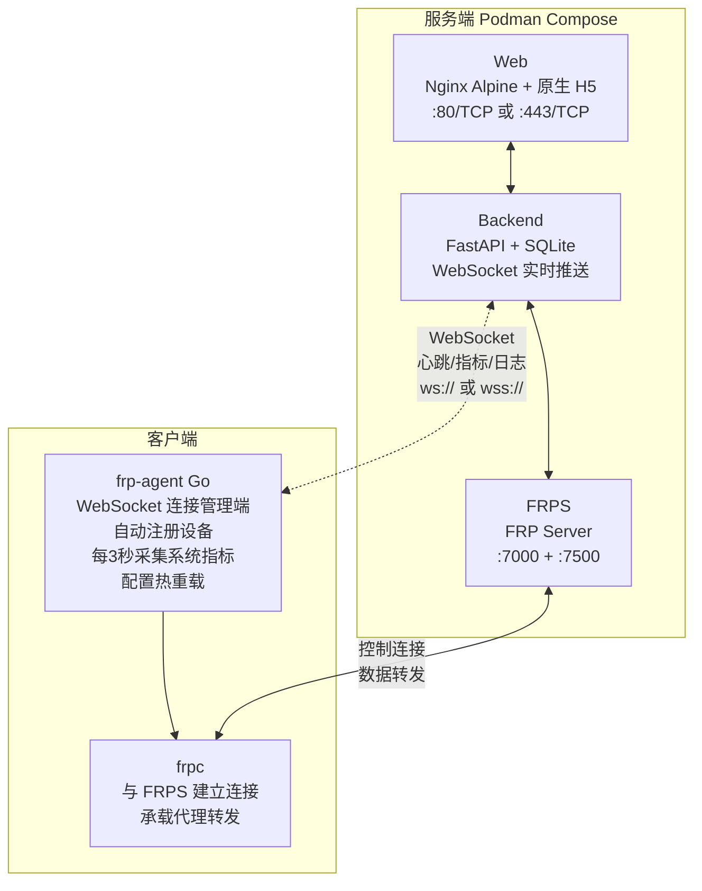

<div align="center">
  <h1>FRP-ALL-IN-ONE</h1>
  <p>一个基于 Web 的 FRP 内网穿透管理系统：用浏览器完成 <b>FRPS 配置</b>、<b>客户端一键部署</b>、<b>设备注册/心跳</b>、<b>端口映射管理</b>，并提供<b>实时流量监控</b>与<b>系统资源监控</b>。</p>
  <p><b>极致轻量 · 开箱即用 · 功能强大</b></p>
  <p>
    <a href="https://github.com/GreenhandTan/FRP-ALL-IN-ONE/stargazers"></a>
    <a href="LICENSE"></a>
    
    
    
    
  </p>
  <p>
    <a href="#highlights">核心优势</a> ·
    <a href="#features">功能特性</a> ·
    <a href="#quick-start-server">部署指南</a> ·
    <a href="#ports">端口放行</a> ·
    <a href="#troubleshooting">排障</a> ·
    <a href="#license">开源协议</a>
  </p>
  <p>
    <a href="README.md">简体中文</a> |
    <a href="README.en.md">English</a> |
    <a href="README.zh-TW.md">繁體中文</a>
  </p>
</div>

<a id="author"></a>

## 作者与社区

- 博客：https://greenhandtan.top

<a id="stars"></a>

## Star History

[](https://www.star-history.com/#GreenhandTan/FRP-ALL-IN-ONE&type=date&legend=top-left)

<a id="demo"></a>

## 效果演示

### 主控制台


### 实时日志


<a id="toc"></a>

## 目录

- [核心优势](#highlights)
- [核心特性](#features)
- [架构说明](#architecture)
- [快速开始（服务端）](#quick-start-server)
- [首次使用流程](#first-time-workflow)
- [HTTPS 配置（可选）](#https-setup)
- [NAT 访问端口配置（可选）](#nat-port-setup)
- [飞牛 OS 客户端部署说明](#fnos-client)
- [端口与安全组](#ports)
- [监控与统计说明](#monitoring)
- [常用运维命令](#ops)
- [排障指南](#troubleshooting)
- [卸载客户端](#uninstall)
- [项目结构](#layout)
- [开发与构建](#development)
- [开源协议与使用要求](#license)

<a id="highlights"></a>

## 核心优势

### 极致轻量

- **1核1G 服务器即可流畅运行**：经过实际测试，最低配置（1 vCPU + 1 GB RAM）的云服务器完全满足系统部署与运行需求
- **前端零依赖构建**：Web 界面使用原生 H5 + CSS + JS 编写，无需 Node.js、无需 npm install，无构建工具链，浏览器直接加载
- **轻量后端技术栈**：FastAPI + SQLite，无需 MySQL/PostgreSQL，数据文件仅数 MB，极低磁盘与内存占用
- **容器极度精简**：Nginx Alpine 镜像 + 纯静态文件，Web 容器内存占用 < 10 MB

> **实例：超低配 LXC 服务器实测**  
> 通过「**本地构建 + 云端导入**」的特殊部署手法（在本地构建好项目镜像后导入云服务器，绕过内存不足的构建限制），本项目可在 **1核 256MB 内存 + 2G 数据盘** 的 LXC 架构云服务器上流畅运行，实现完整的内网穿透集中管理。作者实测机器售价仅 **¥29.9 / 三年**，极具性价比。详细部署思路参见：[作者博客 Blog#25](https://greenhandtan.top/blog/25)

### 开箱即用

- **一条命令完成全部部署**：`git clone` + 执行 `deploy.sh`，自动处理依赖安装、容器构建、服务启动
- **可视化配置向导**：首次登录后通过 Web 界面的引导向导完成 FRPS 配置（IP/域名模式可选），无需手动编辑任何配置文件
- **客户端脚本自动生成**：在控制台一键生成针对不同平台（Linux/macOS/Windows）、不同架构（x86/ARM/MIPS）的部署脚本，复制后直接在内网机器执行
- **NAT 穿透兼容**：支持在 NAT 环境下显式配置管理面板公网访问端口（如 `公网IP:10967 → 内网80`），生成的客户端脚本自动使用正确地址

### 功能强大

- **WebSocket 实时推送**：每秒推送全局状态，每个客户端的 CPU/内存/磁盘/网络指标实时可见，无需手动刷新
- **配置热重载**：通过 FRPC Admin API 动态增删端口映射，通道变更立即生效，无需重启 frpc 进程
- **HTTPS 全自动**：域名模式下一键申请 Let's Encrypt 证书并自动续期（到期前 30 天），也支持上传自定义证书
- **多架构 Agent**：Go 编写的 frp-agent 支持 x86_64 / ARM64 / ARMv7 / MIPS，覆盖树莓派、路由器等各类设备
- **完善的安全机制**：JWT 鉴权、API 限流、强制首次改密、密码强度校验，生产级别安全保障

---

<a id="features"></a>

## 核心特性

### 部署与管理

- **一键部署**：Podman Compose 启动管理后台、Web、FRPS
- **配置向导**：Web 界面完成 FRPS 端口、Token、公网 IP 设置
- **一键脚本**：自动生成客户端部署脚本（支持多架构、systemd、开机自启）
- **HTTPS 全自动**：支持自动申请 Let's Encrypt 证书或上传自定义证书
- **NAT 端口配置**：支持 NAT 云服务器显式指定管理面板公网端口，脚本生成自动感知

### 安全增强

- **强制修改密码**：首次登录强制修改默认密码，密码强度校验（8位+大小写+数字）
- **JWT 安全**：自动生成强密钥并持久化，支持环境变量覆盖
- **API 限流**：登录接口 5次/分钟，证书申请 3次/小时，防止暴力破解
- **证书自动续期**：Let's Encrypt 证书自动续期，到期前 30 天自动处理

### 实时监控

- **实时流量监控**：Agent 每 3 秒采集网络流量速率，WebSocket 实时推送
- **系统资源监控**：CPU、内存、磁盘使用率实时显示
- **累计流量统计**：顶部卡片展示所有客户端的累计总流量
- **隧道流量统计**：每个隧道独立显示累计流量

### Agent 机制

- **自动注册**：客户端自动上报 hostname、OS、架构，自动命名设备
- **心跳上报**：定时上报系统指标（CPU、内存、磁盘、网络速率）
- **配置热重载**：通过 FRPC Admin API 热重载配置，无需重启服务
- **实时日志**：WebSocket 推送 FRPC 运行日志到控制台
- **协议自适应**：Agent 自动检测服务器协议（ws/wss）并切换

### 其他特性

- **WebSocket 实时推送**：每秒推送状态更新，无需手动刷新
- **国际化**：支持简体中文/英文/繁体中文三语切换
- **原生 H5 前端**：无构建工具依赖，直接部署静态文件，维护极简
- **数据持久化**：SQLite 数据库和证书自动持久化到 Podman 卷

<a id="architecture"></a>

## 架构说明


```mermaid
flowchart TB
    subgraph Server["服务端 Podman Compose"]
        Web["Web<br/>Nginx Alpine + 原生 H5<br/>:80/TCP 或 :443/TCP"]
        Backend["Backend<br/>FastAPI + SQLite<br/>WebSocket 实时推送"]
        FRPS["FRPS<br/>FRP Server<br/>:7000 + :7500"]
        Web <--> Backend
        Backend <--> FRPS
    end

    subgraph Client["客户端"]
        Agent["frp-agent Go<br/>WebSocket 连接管理端<br/>自动注册设备<br/>每3秒采集系统指标<br/>配置热重载"]
        FRPC["frpc<br/>与 FRPS 建立连接<br/>承载代理转发"]
        Agent --> FRPC
    end

    Backend <-.->|"WebSocket<br/>心跳/指标/日志<br/>ws:// 或 wss://"| Agent
    FRPS <-->|"控制连接<br/>数据转发"| FRPC
```

<a id="quick-start-server"></a>

## 快速开始（服务端）

### 前置要求

- 一台具备公网 IP 的服务器（**建议 Linux 系统，最低 1核1G 即可流畅运行**，实测验证）
- Podman & Podman Compose（脚本可自动安装）
- 端口放行（至少）：80/TCP、FRPS 端口（默认 7000/TCP）

> **系统建议**：本项目基于 Podman 部署，脚本支持自动识别 Linux 发行版并安装依赖（含 Alpine / Debian / Ubuntu / RHEL 系）。Windows 和 macOS 可作为客户端运行，服务端建议使用 Linux。

> **轻量提示**：前端为原生 H5 纯静态文件，Nginx 容器内存占用 < 10 MB；后端 FastAPI + SQLite，整套系统在 1核1G 机器上运行绰绰有余。

### 一键部署

```bash
git clone https://github.com/GreenhandTan/FRP-ALL-IN-ONE.git
cd FRP-ALL-IN-ONE/deploy

chmod +x deploy.sh
sudo ./deploy.sh
```

### 默认账户

| 用户名 | 密码   |
| ------ | ------ |
| admin  | 123456 |

> **注意**：系统已强制要求首次登录后修改默认密码，密码需满足：至少 8 位，包含大写字母、小写字母和数字。

### 低内存服务器（512MB 或更低）

如服务器内存低于 1 GB，建议先开启 Swap 再部署：

```bash
cd FRP-ALL-IN-ONE/deploy
chmod +x setup-swap.sh
sudo ./setup-swap.sh   # 创建 2GB Swap
sudo ./deploy.sh
```

> 1核1G 的服务器通常无需开启 Swap 即可直接部署。

### 数据持久化

当前 `compose.yml` 已默认启用数据持久化：

- `frp-data`：FRP 配置文件持久化
- `frp-certs`：SSL 证书持久化
- `./data`：SQLite 数据库持久化

<a id="first-time-workflow"></a>

## 首次使用流程

### 1) 登录管理台

访问：`http://<服务器公网IP>`

使用默认账户登录后，系统将**强制要求修改密码**。

### 2) 配置 FRPS（向导）

在向导中设置：

- 监听端口（默认 7000）
- 公网 IP（支持自动探测）

### 3) 部署客户端

在向导"客户端脚本"页面下载脚本，在内网机器执行：

```bash
chmod +x deploy-frpc.sh
sudo ./deploy-frpc.sh
```

### 4) 创建端口映射

在控制台"设备列表"中：

1. 选择设备 → 新增映射（TCP/UDP/HTTP/HTTPS）
2. 等待 Agent 同步并热重载
3. 通过 `公网IP:remote_port` 访问内网服务

<a id="https-setup"></a>

## HTTPS 配置（可选）

系统支持两种 HTTPS 启用方式：

### 方式一：自动申请 Let's Encrypt 证书（推荐）

1. 进入"系统设置 → 域名与 HTTPS"
2. 输入你的域名（如 `frp.example.com`）
3. 按提示将域名 A 记录解析到服务器公网 IP
4. 点击"检测 DNS"验证解析是否正确
5. 点击"启用 HTTPS"，系统将自动：
   - 申请 Let's Encrypt 证书
   - 配置 Nginx
   - 重载服务
6. 完成后自动跳转到 `https://你的域名`

> **自动续期**：证书将在过期前 30 天自动续期，无需手动干预。

### 方式二：上传自定义证书

1. 进入"系统设置 → 域名与 HTTPS"
2. 选择"自定义证书"标签
3. 上传证书文件（.crt/.pem）和私钥文件（.key）
4. 输入域名并启用 HTTPS

### 查看证书状态

```bash
# 查看证书信息和过期时间
curl http://localhost:8000/api/settings/tls-status
```

<a id="nat-port-setup"></a>

## NAT 访问端口配置（可选）

> **适用场景**：你的云服务器不是直接使用公网 IP 部署，而是通过 NAT 端口映射访问，例如：
> `公网 151.242.85.89:10967` → 内网 `服务器:80`（管理面板走 NAT 映射）

在这种场景下，如果不做额外配置，系统生成的客户端安装脚本中会缺少端口号（默认 80），导致 Agent 无法连接到管理面板。

### 配置方式

1. 登录管理控制台，点击右上角**齿轮图标**（⚙）
2. 在「管理面板公网访问端口」一栏填写 NAT 映射的公网端口（如 `10967`）
3. 点击「保存」

配置保存后，之后生成的所有客户端安装脚本将自动使用：

```
ws://151.242.85.89:10967/ws/agent/<CLIENT_ID>
```

### 地址解析优先级

脚本生成时 `MANAGER_WS_URL` 的地址按以下优先级确定：

| 优先级 | 条件                             | 使用的地址                 |
| ------ | -------------------------------- | -------------------------- |
| ① 最高 | 已通过设置页面配置 NAT 端口      | `ws://公网IP:NAT端口`      |
| ②      | 浏览器请求携带 Host 头（含端口） | `ws://Host头中的host:port` |
| ③      | 已启用 HTTPS + 配置域名          | `wss://域名`               |
| ④ 兜底 | 其余情况                         | `ws://公网IP`              |

> **普通云服务器**：无需任何配置，留空即可，系统自动使用公网 IP。

<a id="fnos-client"></a>

## 飞牛 OS 客户端部署说明

可以，但需要区分“Agent 能运行”和“当前一键脚本能直接运行”这两件事。

- **可以作为客户端部署**：飞牛 OS 本质上属于 Linux 环境，只要设备架构是 `x86_64` 或 `arm64`，理论上即可运行本项目的 Linux Agent。
- **当前一键脚本有前提**：现有 Linux 安装脚本默认依赖 `systemd`、`sudo`、`/opt/frp` 可写，以及 `curl`/`wget` 等常见工具。
- **若飞牛 OS 提供标准 Linux 用户态**：可直接尝试使用控制台生成的 Linux 客户端脚本安装。
- **若飞牛 OS 不带 systemd 或限制系统服务**：Agent 和 frpc 仍可能可以运行，但需要改为手动启动，或接入飞牛自己的任务/服务管理方式，当前一键脚本不一定能直接成功。

建议先在飞牛 OS 上检查以下命令：

```bash
uname -m
command -v systemctl
command -v curl
command -v wget
test -w /opt || sudo test -w /opt
```

判定原则：

- 输出为 `x86_64` 或 `aarch64`：架构满足。
- 存在 `systemctl`，且 `/opt` 可写：通常可直接使用当前脚本。
- 缺少 `systemctl`：建议改为手动部署或使用飞牛 OS 自带的服务管理机制。

<a id="ports"></a>

## 端口与安全组

| 端口                      | 协议    | 用途                        |
| ------------------------- | ------- | --------------------------- |
| 80                        | TCP     | Web 管理界面（HTTP）        |
| 443                       | TCP     | Web 管理界面（HTTPS，可选） |
| 7000（或自定义 bindPort） | TCP     | frpc 控制连接               |
| 49152-65535               | TCP/UDP | 推荐的私有端口范围          |

> 每个 `remote_port` 都需要在安全组中放行才能从外部访问。

<a id="monitoring"></a>

## 监控与统计说明

### 数据刷新频率

| 环节                 | 刷新频率         |
| -------------------- | ---------------- |
| Agent 系统指标采集   | 每 3 秒          |
| WebSocket 推送到前端 | 每 1 秒          |
| 前端 UI 更新         | 实时（事件驱动） |
| FRPS 状态缓存刷新    | 每 5 秒          |
| 证书续期检查         | 每 24 小时       |

### 流量统计口径

| 指标                      | 说明                                              |
| ------------------------- | ------------------------------------------------- |
| 顶部"总流量"              | 所有客户端的机器级别累计流量（包含所有网络流量）  |
| 客户端卡片"传入/传出流量" | 该客户端的实时网络速率（B/s、KB/s、MB/s）         |
| 隧道"总流量"              | 该隧道的累计流量（来自 FRPS API，连接关闭后更新） |

### 在线状态判断

- Agent 心跳 `last_seen` 在 30 秒内视为在线
- WebSocket 连接状态实时显示

<a id="ops"></a>

## 常用运维命令

### 服务端（Podman）

```bash
cd FRP-ALL-IN-ONE/deploy

# 查看状态
podman compose -f compose.yml ps
podman compose -f compose.yml logs -f

# 重启服务
podman compose -f compose.yml restart
podman restart frps

# 更新到最新版本
podman compose -f compose.yml down
git pull
podman compose -f compose.yml up -d --build

# 查看证书续期日志
podman exec frp-manager-backend cat /var/log/acme.cron.log
```

### 客户端

```bash
# frp-agent 状态
systemctl status frp-agent --no-pager
journalctl -u frp-agent -n 200 --no-pager
```

<a id="troubleshooting"></a>

## 排障指南

### 端口映射创建了但访问不了

1. **检查外网连通性**（在非服务器本机测试）

   ```bash
   nc -vz <公网IP> <remote_port>
   ```

2. **检查安全组/防火墙**：确认端口已放行

3. **检查 FRPS 是否监听**

   ```bash
   ss -lntp | grep :<remote_port>
   podman logs frps --tail 200
   ```

4. **检查客户端配置同步**
   ```bash
   grep -n "<remote_port>" /opt/frp/frpc.toml
   journalctl -u frp-agent -n 200 --no-pager
   ```

### 设备无法注册/不显示

```bash
systemctl status frp-agent --no-pager
cat /opt/frp/agent.json
```

确认 Agent 服务正常运行且能连接到管理端。

### HTTPS 证书申请失败

1. **检查 DNS 解析**：确保域名 A 记录已正确指向服务器公网 IP
2. **检查端口 80**：Let's Encrypt 验证需要临时使用 80 端口
3. **查看日志**：`podman logs frp-manager-backend | grep -i "cert\|acme"`
4. **手动触发续期**：在 Web 界面点击"续期证书"按钮

<a id="uninstall"></a>

## 卸载客户端

```bash
cd FRP-ALL-IN-ONE/deploy
chmod +x uninstall-frpc.sh
sudo ./uninstall-frpc.sh
```

<a id="layout"></a>

## 项目结构

```
FRP-ALL-IN-ONE/
├── agent/                 # 设备端 Agent（Go 语言）
│   ├── cmd/frp-agent/     # 主程序入口
│   └── internal/          # 内部模块
│       ├── config/        # 配置管理
│       ├── frpc/          # FRPC 进程管理
│       ├── logger/        # 日志采集
│       ├── monitor/       # 系统监控（CPU/内存/磁盘/网络）
│       └── ws/            # WebSocket 客户端
├── server/                # 后端 API（FastAPI + SQLite）
│   ├── core/              # 核心基础设施
│   │   ├── dependencies.py    # 依赖注入（认证、数据库）
│   │   ├── exceptions.py      # 统一异常处理
│   │   └── rate_limit.py      # API 限流
│   ├── routers/           # API 路由
│   │   ├── auth.py            # 认证（登录、修改密码）
│   │   ├── clients.py         # 客户端、隧道管理
│   │   ├── agents.py          # Agent 管理、指标查询
│   │   ├── frp_server.py      # FRPS 管理、安装脚本
│   │   ├── system.py          # 系统状态
│   │   └── settings.py        # 域名与 HTTPS 设置
│   └── services/          # 业务逻辑层
│       ├── tls_manager.py     # 证书申请、Nginx 配置
│       └── dns_checker.py     # DNS 解析验证
├── frontend/               # Web 界面（原生 H5 + CSS + JS，无构建工具依赖）
│   ├── index.html          # 单页应用入口
│   ├── style.css           # 全局样式
│   └── app.js              # 全部前端逻辑
├── deploy/                # 部署脚本 & compose
├── demo.png               # 演示截图
└── demo-logs.png          # 日志功能截图
```

<a id="development"></a>

## 开发与构建

### 前端

前端为原生 H5，**无需任何构建步骤**，直接编辑 `frontend/` 下的三个文件：

```
frontend/
├── index.html   # 页面结构与模板
├── style.css    # 样式
└── app.js       # 全部交互逻辑
```

本地预览可用任意静态文件服务器：

```bash
cd frontend
python3 -m http.server 3000
```

### Agent

```bash
cd agent
go build -o frp-agent ./cmd/frp-agent
```

多平台交叉编译示例：

```bash
# Linux ARM64（树莓派等）
GOOS=linux GOARCH=arm64 go build -o frp-agent-linux-arm64 ./cmd/frp-agent
# Linux x86_64
GOOS=linux GOARCH=amd64 go build -o frp-agent-linux-amd64 ./cmd/frp-agent
```

### 后端

后端以 Podman 方式运行最稳定；如需本地运行可参考 `server/` 目录。

```bash
cd server
pip install -r requirements.txt
python -m uvicorn main:app --reload
```

<a id="license"></a>

## 开源协议与使用要求

本项目采用 **MIT License**（见 [LICENSE](LICENSE)）。

你可以：

- 免费使用（个人/组织）
- 免费商用
- 修改、二次开发、分发

你需要遵守：

- 保留许可证与版权声明
- 注明原作者为 **GreenhandTan**

## 安全建议

- 首次登录后立即修改默认密码（系统已强制要求）
- 使用强密码（至少 8 位，包含大小写+数字）
- 定期更新 Podman 镜像
- 安全组仅开放必要端口
- FRPS Dashboard（7500）建议仅允许本机访问
- 启用 HTTPS 以加密通信（推荐生产环境使用）

## 致谢

- [FRP](https://github.com/fatedier/frp) - 优秀的内网穿透工具
- [gopsutil](https://github.com/shirou/gopsutil) - Go 系统监控库
- [acme.sh](https://github.com/acmesh-official/acme.sh) - 全功能 Let's Encrypt 客户端

---

如果这个项目对您有帮助，欢迎给我们一个 Star。
