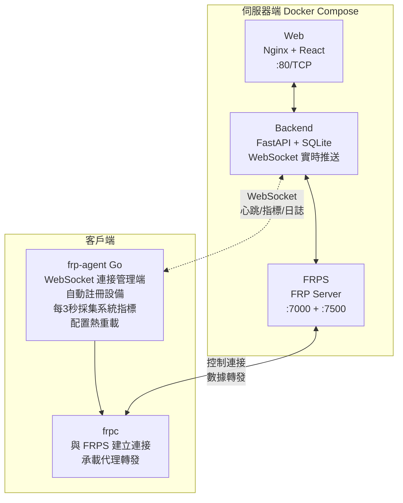

<div align="center">
  <h1>FRP-ALL-IN-ONE</h1>
  <p>一個基於 Web 的 FRP 內網穿透管理系統：用瀏覽器完成 <b>FRPS 配置</b>、<b>客戶端一鍵部署</b>、<b>設備註冊/心跳</b>、<b>端口映射管理</b>，並提供<b>實時流量監控</b>與<b>系統資源監控</b>。</p>
  <p>
    <a href="https://github.com/GreenhandTan/FRP-ALL-IN-ONE/stargazers"></a>
    <a href="LICENSE"></a>
    
    
    
    
  </p>
  <p>
    <a href="#features">功能特性</a> ·
    <a href="#quick-start-server">部署指南</a> ·
    <a href="#ports">端口放行</a> ·
    <a href="#troubleshooting">排障</a> ·
    <a href="#license">開源協議</a>
  </p>
  <p>
    <a href="README.md">简体中文</a> |
    <a href="README.en.md">English</a> |
    <a href="README.zh-TW.md">繁體中文</a>
  </p>
</div>

<a id="author"></a>

## 作者與社區

- 部落格：https://greenhandtan.top

<a id="stars"></a>

## Star History

[](https://www.star-history.com/#GreenhandTan/FRP-ALL-IN-ONE&type=date&legend=top-left)

<a id="demo"></a>

## 效果演示

### 主控制台


### 實時日誌


<a id="toc"></a>

## 目錄

- [核心特性](#features)
- [架構說明](#architecture)
- [快速開始（伺服器端）](#quick-start-server)
- [首次使用流程](#first-time-workflow)
- [端口與安全組](#ports)
- [監控與統計說明](#monitoring)
- [常用運維命令](#ops)
- [排障指南](#troubleshooting)
- [卸載客戶端](#uninstall)
- [項目結構](#layout)
- [開發與構建](#development)
- [開源協議與使用要求](#license)

<a id="features"></a>

## 核心特性

### 🚀 部署與管理

- **一鍵部署**：Docker Compose 啟動管理後台、Web、FRPS
- **配置嚮導**：Web 介面完成 FRPS 端口、Token、公網 IP 設置
- **一鍵腳本**：自動生成客戶端部署腳本（支持多架構、systemd、開機自啟）

### 📊 實時監控

- **實時流量監控**：Agent 每 3 秒採集網路流量速率，WebSocket 實時推送
- **系統資源監控**：CPU、記憶體、磁碟使用率實時顯示
- **累計流量統計**：頂部卡片展示所有客戶端的累計總流量
- **隧道流量統計**：每個隧道獨立顯示累計流量

### 🔧 Agent 機制

- **自動註冊**：客戶端自動上報 hostname、OS、架構，自動命名設備
- **心跳上報**：定時上報系統指標（CPU、記憶體、磁碟、網路速率）
- **配置熱重載**：通過 FRPC Admin API 熱重載配置，無需重啟服務
- **實時日誌**：WebSocket 推送 FRPC 運行日誌到控制台

### 🌐 其他特性

- **WebSocket 實時推送**：每秒推送狀態更新，無需手動刷新
- **國際化**：支持中文/英文切換
- **統一彈窗**：全站使用輕量級彈窗組件

<a id="architecture"></a>

## 架構說明



<a id="quick-start-server"></a>

## 快速開始（伺服器端）

### 前置要求

- 一台具備公網 IP 的伺服器
- Docker & Docker Compose
- 端口放行（至少）：80/TCP、FRPS 端口（預設 7000/TCP）

### 一鍵部署

```bash
git clone https://github.com/GreenhandTan/FRP-ALL-IN-ONE.git
cd FRP-ALL-IN-ONE/deploy

chmod +x deploy.sh
sudo ./deploy.sh
```

### 預設帳戶

| 用戶名 | 密碼   |
| ------ | ------ |
| admin  | 123456 |

> ⚠️ 請登入後立即修改預設密碼！

### 低記憶體伺服器（512MB-1GB）

```bash
cd FRP-ALL-IN-ONE/deploy
chmod +x setup-swap.sh
sudo ./setup-swap.sh
sudo ./deploy.sh
```

### 數據持久化說明

當前 `docker-compose.yml` 未對後端 SQLite 資料庫做持久化掛載。如需持久化，請在 `deploy/docker-compose.yml` 中為 backend 增加卷掛載。

<a id="first-time-workflow"></a>

## 首次使用流程

### 1) 登入管理台

訪問：`http://<伺服器公網IP>`

### 2) 配置 FRPS（嚮導）

在嚮導中設置：

- 監聽端口（預設 7000）
- 公網 IP（支持自動探測）

### 3) 部署客戶端

在嚮導「客戶端腳本」頁面下載腳本，在內網機器執行：

```bash
chmod +x deploy-frpc.sh
sudo ./deploy-frpc.sh
```

### 4) 創建端口映射

在控制台「設備列表」中：

1. 選擇設備 → 新增映射（TCP/UDP/HTTP/HTTPS）
2. 等待 Agent 同步並熱重載
3. 通過 `公網IP:remote_port` 訪問內網服務

<a id="ports"></a>

## 端口與安全組

| 端口                      | 協議    | 用途               |
| ------------------------- | ------- | ------------------ |
| 80                        | TCP     | Web 管理介面       |
| 7000（或自定義 bindPort） | TCP     | frpc 控制連接      |
| 49152-65535               | TCP/UDP | 推薦的私有端口範圍 |

> 💡 每個 `remote_port` 都需要在安全組中放行才能從外部訪問。

<a id="monitoring"></a>

## 監控與統計說明

### 數據刷新頻率

| 環節                 | 刷新頻率         |
| -------------------- | ---------------- |
| Agent 系統指標採集   | 每 3 秒          |
| WebSocket 推送到前端 | 每 1 秒          |
| 前端 UI 更新         | 實時（事件驅動） |

### 流量統計口徑

| 指標                        | 說明                                              |
| --------------------------- | ------------------------------------------------- |
| 頂部「總流量」              | 所有客戶端的機器級別累計流量（包含所有網路流量）  |
| 客戶端卡片「傳入/傳出流量」 | 該客戶端的實時網路速率（B/s、KB/s、MB/s）         |
| 隧道「總流量」              | 該隧道的累計流量（來自 FRPS API，連接關閉後更新） |

### 在線狀態判斷

- Agent 心跳 `last_seen` 在 30 秒內視為在線
- WebSocket 連接狀態實時顯示

<a id="ops"></a>

## 常用運維命令

### 伺服器端（Docker）

```bash
cd FRP-ALL-IN-ONE/deploy

# 查看狀態
docker-compose ps
docker-compose logs -f

# 重啟服務
docker-compose restart
docker restart frps

# 重新構建
docker-compose down
docker-compose up -d --build
```

### 客戶端

```bash
# frpc 狀態
systemctl status frpc --no-pager
journalctl -u frpc -n 200 --no-pager

# frp-agent 狀態
systemctl status frp-agent --no-pager
journalctl -u frp-agent -n 200 --no-pager
```

<a id="troubleshooting"></a>

## 排障指南

### 端口映射創建了但訪問不了

1. **檢查外網連通性**（在非伺服器本機測試）

   ```bash
   nc -vz <公網IP> <remote_port>
   ```

2. **檢查安全組/防火牆**：確認端口已放行

3. **檢查 FRPS 是否監聽**

   ```bash
   ss -lntp | grep :<remote_port>
   docker logs frps --tail 200
   ```

4. **檢查客戶端配置同步**
   ```bash
   grep -n "<remote_port>" /opt/frp/frpc.toml
   journalctl -u frp-agent -n 200 --no-pager
   ```

### 設備無法註冊/不顯示

```bash
systemctl status frp-agent --no-pager
cat /opt/frp/agent.json
```

確認 Agent 服務正常運行且能連接到管理端。

<a id="uninstall"></a>

## 卸載客戶端

```bash
cd FRP-ALL-IN-ONE/deploy
chmod +x uninstall-frpc.sh
sudo ./uninstall-frpc.sh
```

<a id="layout"></a>

## 項目結構

```
FRP-ALL-IN-ONE/
├── agent/                 # 設備端 Agent（Go 語言）
│   ├── cmd/frp-agent/     # 主程式入口
│   └── internal/          # 內部模組
│       ├── config/        # 配置管理
│       ├── frpc/          # FRPC 進程管理
│       ├── logger/        # 日誌採集
│       ├── monitor/       # 系統監控（CPU/記憶體/磁碟/網路）
│       └── ws/            # WebSocket 客戶端
├── server/                # 後端 API（FastAPI + SQLite）
├── frontend/              # Web 介面（React + Vite + TailwindCSS）
├── deploy/                # 部署腳本 & docker-compose
├── demo.png               # 演示截圖
└── demo-logs.png          # 日誌功能截圖
```

<a id="development"></a>

## 開發與構建

### 前端

```bash
cd frontend
npm install
npm run dev
```

### Agent

```bash
cd agent
go build -o frp-agent ./cmd/frp-agent
```

### 後端

後端以 Docker 方式運行最穩定；如需本地運行可參考 `server/` 目錄。

<a id="license"></a>

## 開源協議與使用要求

本項目採用 **MIT License**（見 [LICENSE](LICENSE)）。

你可以：

- 免費使用（個人/組織）
- 免費商用
- 修改、二次開發、分發

你需要遵守：

- 保留許可證與版權聲明
- 註明原作者為 **GreenhandTan**

## 🛡️ 安全建議

- ✅ 首次登入後立即修改預設密碼
- ✅ 使用強密碼（至少 12 位）
- ✅ 定期更新 Docker 映像
- ✅ 安全組僅開放必要端口
- ✅ FRPS Dashboard（7500）建議僅允許本機訪問

## 🙏 致謝

- [FRP](https://github.com/fatedier/frp) - 優秀的內網穿透工具
- [gopsutil](https://github.com/shirou/gopsutil) - Go 系統監控庫

---

**⭐ 如果這個項目對您有幫助，請給我們一個 Star！**
