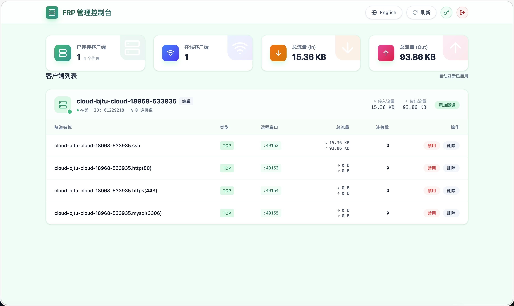

<div align="center">
  <h1>FRP-ALL-IN-ONE</h1>
  <p>一個基於 Web 的 FRP 內網穿透管理系統：用瀏覽器完成 <b>FRPS 配置</b>、<b>客戶端一鍵部署</b>、<b>裝置註冊/心跳</b>、<b>連接埠映射管理</b>，並提供近即時的連線/流量展示與排障路徑。</p>
  <p>
    <a href="https://github.com/GreenhandTan/FRP-ALL-IN-ONE/stargazers"></a>
    <a href="LICENSE"></a>
    
    
    
    
  </p>
  <p>
    <a href="#features">核心特性</a> ·
    <a href="#quick-start-server">部署指南</a> ·
    <a href="#ports">連接埠放行</a> ·
    <a href="#troubleshooting">排障</a> ·
    <a href="#license">開源協議</a>
  </p>
  <p>
    <a href="README.md">簡體中文</a> |
    <a href="README.en.md">English</a> |
    <a href="README.zh-TW.md">繁體中文</a>
  </p>
</div>

<a id="author"></a>
## 作者與社群

- 部落格：https://greenhandtan.top

<a id="stars"></a>
## Star History

[](https://www.star-history.com/#GreenhandTan/FRP-ALL-IN-ONE&type=date&legend=top-left)

<a id="demo"></a>
## 效果演示



<a id="toc"></a>
## 目錄

- [核心特性](#features)
- [架構說明](#architecture)
- [快速開始（服務端）](#quick-start-server)
- [首次使用流程](#first-time-workflow)
- [連接埠與安全組](#ports)
- [監控與統計口徑](#monitoring)
- [常用運維命令](#ops)
- [排障指南](#troubleshooting)
- [卸載客戶端](#uninstall)
- [專案結構](#layout)
- [開發與建置](#development)
- [開源協議與使用要求](#license)

<a id="features"></a>
## 核心特性

- 一鍵部署：Docker Compose 啟動管理後台、Web、FRPS
- 配置嚮導：Web 中完成 FRPS 連接埠、Token、公網 IP 設定
- 一鍵腳本：自動生成客戶端腳本（含架構辨識、systemd、開機自啟）
- Agent 機制：客戶端自動註冊、心跳上報、配置同步、`frpc reload` 熱更新
- 近即時面板：狀態/流量/連線數輪詢刷新（預設每 3 秒）
- 國際化：中文/英文切換
- 統一彈窗：全站使用同一套輕量彈窗元件（取代瀏覽器預設 alert/confirm）

<a id="architecture"></a>
## 架構說明

本專案以 **3 個容器** 運行（皆使用 `network_mode: host`）：

- Web（Nginx + React）：對外提供管理介面（預設 80/TCP）
- Backend（FastAPI + SQLite）：提供 API、生成配置、重啟 FRPS、拉取 FRPS Dashboard 數據
- FRPS：FRP 服務端（預設 7000/TCP）+ Dashboard（預設 7500/TCP，建議僅內網可存取）

客戶端側由兩部分組成：

- `frpc`：與 FRPS 建立控制連線並承載代理轉發
- `frp-agent`：向管理端自註冊、上報心跳、拉取你在 Web 裡配置的連接埠映射，並對 `frpc` 執行熱重載

<a id="quick-start-server"></a>
## 快速開始（服務端）

### 前置要求

- 一台具備公網 IP 的伺服器
- Docker & Docker Compose
- 連接埠放行（至少）：80/TCP、FRPS 連接埠（預設 7000/TCP）

### 一鍵部署

```bash
git clone https://github.com/GreenhandTan/FRP-ALL-IN-ONE.git
cd FRP-ALL-IN-ONE/deploy

chmod +x deploy.sh
sudo ./deploy.sh
```

### 預設帳號

| 使用者名稱 | 密碼 |
|--------|------|
| admin | 123456 |

請登入後立即修改預設密碼。

### 低記憶體伺服器（512MB-1GB）

```bash
cd FRP-ALL-IN-ONE/deploy
chmod +x setup-swap.sh
sudo ./setup-swap.sh
sudo ./deploy.sh
```

### 資料持久化說明（重要）

目前 `deploy/docker-compose.yml` 未對後端 SQLite 資料庫做持久化掛載；若你重建/清理容器，**裝置/隧道等管理資料可能會遺失**。  
FRPS 配置檔 `deploy/frps.toml` 已在宿主機上持久化。

若需持久化後台資料，可自行在 `deploy/docker-compose.yml` 中為 backend 增加卷掛載（例如將 `frp_manager.db` 掛載到宿主機目錄）。

<a id="first-time-workflow"></a>
## 首次使用流程

### 1) 登入管理台

訪問：`http://<伺服器公網IP>`

### 2) 配置 FRPS（嚮導）

在嚮導中設定：

- 監聽連接埠（預設 7000）
- 公網 IP（支援自動探測；失敗時手動輸入）

點擊部署後會：

- 生成 `deploy/frps.toml`
- 重啟 FRPS 容器（確保 Token 生效）
- 在頁面展示 Token、公網 IP

公網 IP 自動探測支援多源探測，可用環境變數自訂探測源：

- `PUBLIC_IP_URLS`：以逗號分隔 URL 清單（可選）

### 3) 部署客戶端（frpc + frp-agent）

在嚮導「客戶端腳本」頁面下載/複製腳本，在內網機器執行：

```bash
chmod +x deploy-frpc.sh
sudo ./deploy-frpc.sh
```

腳本會自動：

- 下載對應架構的 `frpc`
- 寫入 `/opt/frp/frpc.toml` 與 systemd 服務
- 安裝並啟動 `frp-agent`（用於裝置註冊/心跳/配置同步）

### 4) 建立連接埠映射

在控制台「裝置列表」中：

1. 選擇裝置 → 新增映射（TCP/UDP/HTTP/HTTPS）
2. 等待 Agent 同步並熱重載（無需重啟服務）
3. 外部即可透過 `公網IP:remote_port` 存取到 `local_ip:local_port`

<a id="ports"></a>
## 連接埠與安全組

雲伺服器安全組/防火牆建議放行：

| 連接埠 | 協議 | 用途 |
|------|------|------|
| 80 | TCP | Web 管理介面 |
| 7000（或你設定的 bindPort） | TCP | frpc 控制連線 |
| 49152-65535 | TCP/UDP | 推薦作為映射使用的私有連接埠範圍（衝突風險更低） |

說明：

- 你在 Web 中建立的每個 `remote_port`，都必須在安全組中允許入站，否則外部無法存取。
- 建議盡量使用 `49152-65535` 私有連接埠範圍；但不強制，你也可以使用其他連接埠（需確認未被占用且已放行）。

安全建議：

- FRPS Dashboard 預設監聽 7500/TCP，為避免暴露管理介面，建議僅允許本機存取（或透過安全組/防火牆限制來源 IP）。

<a id="monitoring"></a>
## 監控與統計口徑

- 面板資料來源：後端從 FRPS Dashboard API 拉取 `serverinfo` 與各類 `proxy` 清單。
- 頁面刷新：預設每 3 秒輪詢更新（近即時）。
- 「線上裝置」：依據 Agent 上報心跳的 `last_seen` 計算（近 30 秒視為線上）。
- 「流量/連線數為 0」的常見原因：
  - 僅建立了 frpc 控制連線，但沒有任何代理流量
  - 外部沒有存取到你的 `remote_port`（安全組未放行、連接埠未監聽等）
  - 新建映射剛下發，尚未完成同步/熱重載

<a id="ops"></a>
## 常用運維命令

### 服務端（Docker）

```bash
cd FRP-ALL-IN-ONE/deploy

docker-compose ps
docker-compose logs -f

docker-compose restart
docker restart frps

docker-compose down
docker-compose up -d --build
```

### 客戶端（frpc）

```bash
systemctl status frpc --no-pager
journalctl -u frpc -n 200 --no-pager

systemctl restart frpc
```

### 客戶端（frp-agent）

```bash
systemctl status frp-agent --no-pager
journalctl -u frp-agent -n 200 --no-pager

cat /opt/frp/agent.json
```

<a id="troubleshooting"></a>
## 排障指南

### 連接埠映射建立了但存取不了（以 SSH 6022→22 為例）

依鏈路由外到內排查：

1. 外網連通性（在非伺服器本機測試）
   ```bash
   nc -vz <公網IP> 6022
   ```
2. 雲安全組/防火牆：確認 6022/TCP（或你選擇的連接埠）已放行
3. FRPS 是否監聽該連接埠（在伺服器上）
   ```bash
   ss -lntp | grep :6022 || echo "no listener"
   docker logs frps --tail 200
   ```
4. 客戶端是否已同步到映射（在客戶端機器）
   ```bash
   grep -n "6022" /opt/frp/frpc.toml || true
   journalctl -u frp-agent -n 200 --no-pager
   journalctl -u frpc -n 200 --no-pager
   ```
5. 客戶端本機 SSH 是否在 22 監聽
   ```bash
   ss -lntp | grep :22 || true
   systemctl status ssh --no-pager || systemctl status sshd --no-pager
   ```

### 客戶端看不到裝置/無法註冊

檢查 `frp-agent` 是否啟動並寫入狀態：

```bash
systemctl status frp-agent --no-pager
cat /opt/frp/agent.json
systemctl cat frp-agent
```

確認 `FRP_MANAGER_URL` 指向你的管理端、`FRP_MANAGER_REGISTER_TOKEN` 已注入。

### Token 不匹配導致 frpc 連線失敗

服務端重新部署後 Token 變化，客戶端仍使用舊 Token。建議重新下載並執行最新客戶端腳本；或手動更新：

```bash
nano /opt/frp/frpc.toml
systemctl restart frpc
```

<a id="uninstall"></a>
## 卸載客戶端

```bash
cd FRP-ALL-IN-ONE/deploy
chmod +x uninstall-frpc.sh
sudo ./uninstall-frpc.sh
```

卸載會停止並禁用 `frpc/frp-agent`，並清理 `/opt/frp` 與 systemd 檔案。

<a id="layout"></a>
## 專案結構

```
FRP-ALL-IN-ONE/
├── agent/                 # 裝置端 Agent（自註冊/心跳/配置同步）
├── server/                # 後端 API (FastAPI)
├── frontend/              # Web 介面 (React + Vite)
├── deploy/                # 部署腳本 & docker-compose
└── README.md
```

<a id="development"></a>
## 開發與建置

### 前端

```bash
cd frontend
npm install
npm run dev
```

### 後端

後端以 Docker 方式運行最穩定；若需本機運行可參考 `server/` 目錄（FastAPI + SQLite）。

<a id="license"></a>
## 開源協議與使用要求

本專案採用 **MIT License**（見 [LICENSE](LICENSE)）。

你可以：

- 免費使用（個人/組織）
- 免費商用
- 修改、二次開發、分發

你需要遵守：

- 轉載、二次開發、分發原始碼/二進位時，必須保留授權條款與版權聲明，並註明原作者為 **GreenhandTan（我）**
- 不得移除或竄改專案中的版權/署名資訊

如需更寬鬆或更嚴格的授權方式，可透過部落格聯絡我： https://greenhandtan.top
