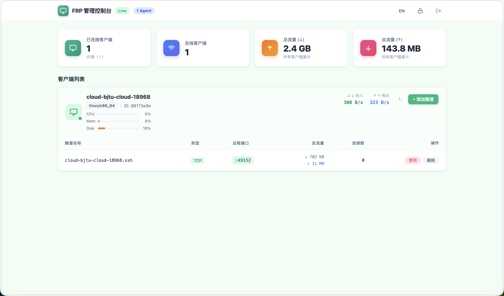
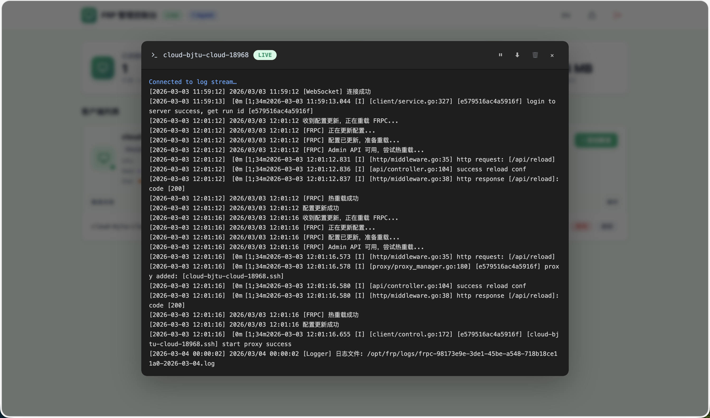
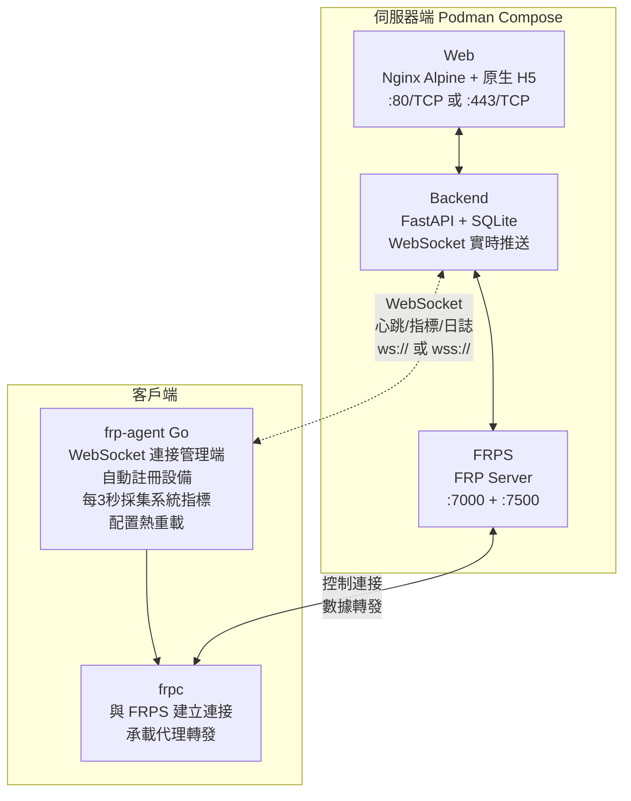

<div align="center">
  <h1>FRP-ALL-IN-ONE</h1>
  <p>一個基於 Web 的 FRP 內網穿透管理系統：用瀏覽器完成 <b>FRPS 配置</b>、<b>客戶端一鍵部署</b>、<b>設備註冊/心跳</b>、<b>端口映射管理</b>，並提供<b>實時流量監控</b>與<b>系統資源監控</b>。</p>
  <p><b>極致輕量 · 開笱即用 · 功能強大</b></p>
  <p>
    <a href="https://github.com/GreenhandTan/FRP-ALL-IN-ONE/stargazers"></a>
    <a href="LICENSE"></a>
    
    
    
    
  </p>
  <p>
    <a href="#highlights">核心優勢</a> ·
    <a href="#features">功能特性</a> ·
    <a href="#quick-start-server">部署指南</a> ·
    <a href="#ports">端口放行</a> ·
    <a href="#troubleshooting">排障</a> ·
    <a href="#license">開源協議</a>
  </p>
  <p>
    <a href="README.md">简体中文</a> |
    <a href="README.en.md">English</a> |
    <a href="README.zh-TW.md">繁體中文</a>
  </p>
</div>

<a id="author"></a>

## 作者與社區

- 部落格：https://greenhandtan.top

<a id="stars"></a>

## Star History

[](https://www.star-history.com/#GreenhandTan/FRP-ALL-IN-ONE&type=date&legend=top-left)

<a id="demo"></a>

## 效果演示

### 主控制台



### 實時日誌



<a id="toc"></a>

## 目錄

- [核心優勢](#highlights)
- [核心特性](#features)
- [架構說明](#architecture)
- [快速開始（伺服器端）](#quick-start-server)
- [首次使用流程](#first-time-workflow)
- [HTTPS 配置（可選）](#https-setup)
- [端口與安全組](#ports)
- [監控與統計說明](#monitoring)
- [常用運維命令](#ops)
- [排障指南](#troubleshooting)
- [卸載客戶端](#uninstall)
- [項目結構](#layout)
- [開發與構建](#development)
- [開源協議與使用要求](#license)

<a id="highlights"></a>

## 核心優勢

### 極致輕量

- **1栻1G 伺服器即可流畅運行**：經過實際測試，最低配置（1 vCPU + 1 GB RAM）的雲伺服器完全滴足系統部署與運行需求
- **前端零依賴構建**：Web 介面使用原生 H5 + CSS + JS 編寫，無需 Node.js、無需 npm install，無構建工具鏈，瀏覽器直接載入
- **輕量後端技術棄**：FastAPI + SQLite，無需 MySQL/PostgreSQL，資料檔案僅數 MB，極低磁碟與記憶體占用
- **容器極度精簡**：Nginx Alpine 鏡像 + 純靜態檔案，Web 容器記憶體占用 < 10 MB

> **實例：超低配 LXC 伺服器實測**  
> 透過「**本地構建 + 雲端導入**」的特殊部署手法（在本地構建好專案映像後匯入雲伺服器，繞過記憶體不足的構建限制），本專案可在 **1核 256MB 記憶體 + 2G 資料盤** 的 LXC 架構雲伺服器上流暢運行，實現完整的內網穿透集中管理。作者實測機器售價僅 **¥29.9 / 三年**，極具性價比。詳細部署思路請參見：[作者博客 Blog#25](https://greenhandtan.top/blog/25)

### 開笱即用

- **一條指令完成全部部署**：`git clone` + 執行 `deploy.sh`，自動處理依賴安裝、容器構建、服務啟動
- **可視化配置導籬**：首次登入後透過 Web 介面導籬完成 FRPS 配置（IP/網域模式可選），無需手動編輯任何配置檔案
- **客戶端腳本自動生成**：在控制台一鍵生成針對不同平台（Linux/macOS/Windows）、不同架構（x86/ARM/MIPS）的部署腳本，複製後直接在內網機器執行

### 功能強大

- **WebSocket 即時推送**：每秒推送全局狀態，每個客戶端的 CPU/記憶體/磁碟/網路指標即時可見，無需手動刷新
- **配置熱重載**：透過 FRPC Admin API 動態新剂端口映射，通道變更立即生效，無需重啟 frpc 處理程序
- **HTTPS 全自動**：網域模式下一鍵申請 Let's Encrypt 憑證並自動續期（到期前 30 天），也支持上傳自定義憑證
- **多架構 Agent**：Go 編寫的 frp-agent 支持 x86_64 / ARM64 / ARMv7 / MIPS，涉蓋樹莓派、路由器等各類設備
- **完善的安全機制**：JWT 鑑權、API 限流、強制首次改密、密碼強度校驗，生產級別安全保障

---

<a id="features"></a>

## 核心特性

### 部署與管理

- **一鍵部署**：Podman Compose 啟動管理後台、Web、FRPS
- **配置嚮導**：Web 介面完成 FRPS 端口、Token、公網 IP 設置
- **一鍵腳本**：自動生成客戶端部署腳本（支持多架構、systemd、開機自啟）
- **HTTPS 全自動**：支持自動申請 Let's Encrypt 證書或上傳自定義證書

### 安全增強

- **強制修改密碼**：首次登入強制修改預設密碼，密碼強度校驗（8位+大小寫+數字）
- **JWT 安全**：自動生成強密鑰並持久化，支持環境變量覆蓋
- **API 限流**：登入接口 5次/分鐘，證書申請 3次/小時，防止暴力破解
- **證書自動續期**：Let's Encrypt 證書自動續期，到期前 30 天自動處理

### 實時監控

- **實時流量監控**：Agent 每 3 秒採集網路流量速率，WebSocket 實時推送
- **系統資源監控**：CPU、記憶體、磁碟使用率實時顯示
- **累計流量統計**：頂部卡片展示所有客戶端的累計總流量
- **隧道流量統計**：每個隧道獨立顯示累計流量

### Agent 機制

- **自動註冊**：客戶端自動上報 hostname、OS、架構，自動命名設備
- **心跳上報**：定時上報系統指標（CPU、記憶體、磁碟、網路速率）
- **配置熱重載**：通過 FRPC Admin API 熱重載配置，無需重啟服務
- **實時日誌**：WebSocket 推送 FRPC 運行日誌到控制台
- **協議自適應**：Agent 自動檸測服務器協議（ws/wss）並切換

### 其他特性

- **WebSocket 實時推送**：每秒推送狀態更新，無需手動刷新
- **國際化**：支持簡體中文/英文/繁體中文三語切換
- **原生 H5 前端**：無構建工具依賴，直接部署靜態檔案，維護極簡
- **資料持久化**：SQLite 資料庫和憑證自動持久化到 Podman 卷

<a id="architecture"></a>

## 架構說明


```mermaid
flowchart TB
    subgraph Server["伺服器端 Podman Compose"]
        Web["Web<br/>Nginx Alpine + 原生 H5<br/>:80/TCP 或 :443/TCP"]
        Backend["Backend<br/>FastAPI + SQLite<br/>WebSocket 實時推送"]
        FRPS["FRPS<br/>FRP Server<br/>:7000 + :7500"]
        Web <--> Backend
        Backend <--> FRPS
    end

    subgraph Client["客戶端"]
        Agent["frp-agent Go<br/>WebSocket 連接管理端<br/>自動註冊設備<br/>每3秒採集系統指標<br/>配置熱重載"]
        FRPC["frpc<br/>與 FRPS 建立連接<br/>承載代理轉發"]
        Agent --> FRPC
    end

    Backend <-.->|"WebSocket<br/>心跳/指標/日誌<br/>ws:// 或 wss://"| Agent
    FRPS <-->|"控制連接<br/>數據轉發"| FRPC
```

<a id="quick-start-server"></a>

## 快速開始（伺服器端）

### 前置要求

- 一台具備公網 IP 的伺服器（**建議 Linux 系統，最低 1栻1G 即可流畅運行**，實測驗證）
- Podman & Podman Compose（可由部署腳本自動安裝）
- 端口放行（至少）：80/TCP、FRPS 端口（預設 7000/TCP）

> **系統建議**：本項目基於 Podman 部署，部署腳本會自動識別 Linux 發行版（含 Alpine、Debian/Ubuntu、RHEL 系）並安裝依賴。

> **輕量提示**：前端為原生 H5 純靜態檔案，Nginx 容器記憶體占用 < 10 MB；後端 FastAPI + SQLite，整套系統在 1栻1G 機器上運行绰绰有餘。

### 一鍵部署

```bash
git clone https://github.com/GreenhandTan/FRP-ALL-IN-ONE.git
cd FRP-ALL-IN-ONE/deploy

chmod +x deploy.sh
sudo ./deploy.sh
```

### 預設帳戶

| 用戶名 | 密碼   |
| ------ | ------ |
| admin  | 123456 |

> **注意**：系統已強制要求首次登入後修改預設密碼，密碼須滿足：至少 8 位，包含大寫字母、小寫字母和數字。

### 低記憶體伺服器（512MB 或更低）

如伺服器記憶體低於 1 GB，建議先開啟 Swap 再部署：

```bash
cd FRP-ALL-IN-ONE/deploy
chmod +x setup-swap.sh
sudo ./setup-swap.sh   # 建立 2GB Swap
sudo ./deploy.sh
```

> 1栻1G 的伺服器通常無需開啟 Swap 即可直接部署。

### 數據持久化

當前 `compose.yml` 已預設啟用數據持久化：

- `frp-data`：FRP 配置文件持久化
- `frp-certs`：SSL 證書持久化
- `./data`：SQLite 資料庫持久化

<a id="first-time-workflow"></a>

## 首次使用流程

### 1) 登入管理台

訪問：`http://<伺服器公網IP>`

使用預設帳戶登入後，系統將**強制要求修改密碼**。

### 2) 配置 FRPS（嚮導）

在嚮導中設置：

- 監聽端口（預設 7000）
- 公網 IP（支持自動探測）

### 3) 部署客戶端

在嚮導「客戶端腳本」頁面下載腳本，在內網機器執行：

```bash
chmod +x deploy-frpc.sh
sudo ./deploy-frpc.sh
```

### 4) 創建端口映射

在控制台「設備列表」中：

1. 選擇設備 → 新增映射（TCP/UDP/HTTP/HTTPS）
2. 等待 Agent 同步並熱重載
3. 通過 `公網IP:remote_port` 訪問內網服務

<a id="https-setup"></a>

## HTTPS 配置（可選）

系統支持兩種 HTTPS 啟用方式：

### 方式一：自動申請 Let's Encrypt 證書（推薦）

1. 進入「系統設置 → 域名與 HTTPS」
2. 輸入你的域名（如 `frp.example.com`）
3. 按提示將域名 A 記錄解析到伺服器公網 IP
4. 點擊「檢測 DNS」驗證解析是否正確
5. 點擊「啟用 HTTPS」，系統將自動：
   - 申請 Let's Encrypt 證書
   - 配置 Nginx
   - 重載服務
6. 完成後自動跳轉到 `https://你的域名`

> **自動續期**：證書將在過期前 30 天自動續期，無需手動干預。

### 方式二：上傳自定義證書

1. 進入「系統設置 → 域名與 HTTPS」
2. 選擇「自定義證書」標籤
3. 上傳證書文件（.crt/.pem）和私鑰文件（.key）
4. 輸入域名並啟用 HTTPS

### 查看證書狀態

```bash
# 查看證書信息和過期時間
curl http://localhost:8000/api/settings/tls-status
```

<a id="ports"></a>

## 端口與安全組

| 端口                      | 協議    | 用途                        |
| ------------------------- | ------- | --------------------------- |
| 80                        | TCP     | Web 管理介面（HTTP）        |
| 443                       | TCP     | Web 管理介面（HTTPS，可選） |
| 7000（或自定義 bindPort） | TCP     | frpc 控制連接               |
| 49152-65535               | TCP/UDP | 推薦的私有端口範圍          |

> 每個 `remote_port` 都需要在安全組中放行才能從外部訪問。

<a id="monitoring"></a>

## 監控與統計說明

### 數據刷新頻率

| 環節                 | 刷新頻率         |
| -------------------- | ---------------- |
| Agent 系統指標採集   | 每 3 秒          |
| WebSocket 推送到前端 | 每 1 秒          |
| 前端 UI 更新         | 實時（事件驅動） |
| FRPS 狀態快取刷新    | 每 5 秒          |
| 憑證續期檢查         | 每 24 小時       |

### 流量統計口徑

| 指標                        | 說明                                              |
| --------------------------- | ------------------------------------------------- |
| 頂部「總流量」              | 所有客戶端的機器級別累計流量（包含所有網路流量）  |
| 客戶端卡片「傳入/傳出流量」 | 該客戶端的實時網路速率（B/s、KB/s、MB/s）         |
| 隧道「總流量」              | 該隧道的累計流量（來自 FRPS API，連接關閉後更新） |

### 在線狀態判斷

- Agent 心跳 `last_seen` 在 30 秒內視為在線
- WebSocket 連接狀態實時顯示

<a id="ops"></a>

## 常用運維命令

### 伺服器端（Podman）

```bash
cd FRP-ALL-IN-ONE/deploy

# 查看狀態
podman compose -f compose.yml ps
podman compose -f compose.yml logs -f

# 重啟服務
podman compose -f compose.yml restart
podman restart frps

# 更新到最新版本
podman compose -f compose.yml down
git pull
podman compose -f compose.yml up -d --build

# 查看證書續期日誌
podman exec frp-manager-backend cat /var/log/acme.cron.log
```

### 客戶端

```bash
# frp-agent 狀態
systemctl status frp-agent --no-pager
journalctl -u frp-agent -n 200 --no-pager
```

<a id="troubleshooting"></a>

## 排障指南

### 端口映射創建了但訪問不了

1. **檢查外網連通性**（在非伺服器本機測試）

   ```bash
   nc -vz <公網IP> <remote_port>
   ```

2. **檢查安全組/防火牆**：確認端口已放行

3. **檢查 FRPS 是否監聽**

   ```bash
   ss -lntp | grep :<remote_port>
   podman logs frps --tail 200
   ```

4. **檢查客戶端配置同步**
   ```bash
   grep -n "<remote_port>" /opt/frp/frpc.toml
   journalctl -u frp-agent -n 200 --no-pager
   ```

### 設備無法註冊/不顯示

```bash
systemctl status frp-agent --no-pager
cat /opt/frp/agent.json
```

確認 Agent 服務正常運行且能連接到管理端。

### HTTPS 證書申請失敗

1. **檢查 DNS 解析**：確保域名 A 記錄已正確指向伺服器公網 IP
2. **檢查端口 80**：Let's Encrypt 驗證需要臨時使用 80 端口
3. **查看日誌**：`podman logs frp-manager-backend | grep -i "cert\|acme"`
4. **手動觸發續期**：在 Web 介面點擊「續期證書」按鈕

<a id="uninstall"></a>

## 卸載客戶端

```bash
cd FRP-ALL-IN-ONE/deploy
chmod +x uninstall-frpc.sh
sudo ./uninstall-frpc.sh
```

<a id="layout"></a>

## 項目結構

```
FRP-ALL-IN-ONE/
├── agent/                 # 設備端 Agent（Go 語言）
│   ├── cmd/frp-agent/     # 主程式入口
│   └── internal/          # 內部模組
│       ├── config/        # 配置管理
│       ├── frpc/          # FRPC 進程管理
│       ├── logger/        # 日誌採集
│       ├── monitor/       # 系統監控（CPU/記憶體/磁碟/網路）
│       └── ws/            # WebSocket 客戶端
├── server/                # 後端 API（FastAPI + SQLite）
│   ├── core/              # 核心基礎設施
│   │   ├── dependencies.py    # 依賴注入（認證、資料庫）
│   │   ├── exceptions.py      # 統一異常處理
│   │   └── rate_limit.py      # API 限流
│   ├── routers/           # API 路由
│   │   ├── auth.py            # 認證（登入、修改密碼）
│   │   ├── clients.py         # 客戶端、隧道管理
│   │   ├── agents.py          # Agent 管理、指標查詢
│   │   ├── frp_server.py      # FRPS 管理、安裝腳本
│   │   ├── system.py          # 系統狀態
│   │   └── settings.py        # 域名與 HTTPS 設置
│   └── services/          # 業務邏輯層
│       ├── tls_manager.py     # 證書申請、Nginx 配置
│       └── dns_checker.py     # DNS 解析驗證
├── frontend/              # Web 介面（原生 H5 + CSS + JS，無構建工具依賴）
│   ├── index.html         # 單頁應用入口
│   ├── style.css          # 全局樣式
│   └── app.js             # 全部前端邏輯
├── deploy/                # 部署腳本 & compose
├── demo.png               # 演示截圖
└── demo-logs.png          # 日誌功能截圖
```

<a id="development"></a>

## 開發與構建

### 前端

前端為原生 H5，**無需任何構建步驟**，直接編輯 `frontend/` 下的三個檔案：

```
frontend/
├── index.html   # 頁面結構與模板
├── style.css    # 樣式
└── app.js       # 全部互動邏輯
```

本地預覽可用任意靜態檔案伺服器：

```bash
cd frontend
python3 -m http.server 3000
```

### Agent

```bash
cd agent
go build -o frp-agent ./cmd/frp-agent
```

多平台交叉編譯範例：

```bash
# Linux ARM64（樹莓派等）
GOOS=linux GOARCH=arm64 go build -o frp-agent-linux-arm64 ./cmd/frp-agent
# Linux x86_64
GOOS=linux GOARCH=amd64 go build -o frp-agent-linux-amd64 ./cmd/frp-agent
```

### 後端

後端以 Podman 方式運行最穩定；如需本地運行：

```bash
cd server
pip install -r requirements.txt
python -m uvicorn main:app --reload
```

<a id="license"></a>

## 開源協議與使用要求

本項目採用 **MIT License**（見 [LICENSE](LICENSE)）。

你可以：

- 免費使用（個人/組織）
- 免費商用
- 修改、二次開發、分發

你需要遵守：

- 保留許可證與版權聲明
- 註明原作者為 **GreenhandTan**

## 安全建議

- 首次登入後立即修改預設密碼（系統已強制要求）
- 使用強密碼（至少 8 位，包含大小寫+數字）
- 定期更新 Podman 鏡像
- 安全組僅開放必要端口
- FRPS Dashboard（7500）建議僅允許本機訪問
- 啟用 HTTPS 以加密通信（推薦生產環境使用）

## 致謝

- [FRP](https://github.com/fatedier/frp) - 優秀的內網穿透工具
- [gopsutil](https://github.com/shirou/gopsutil) - Go 系統監控庫
- [acme.sh](https://github.com/acmesh-official/acme.sh) - 全功能 Let's Encrypt 客戶端

---

如果這個項目對您有幫助，歡迎給我們一個 Star。
