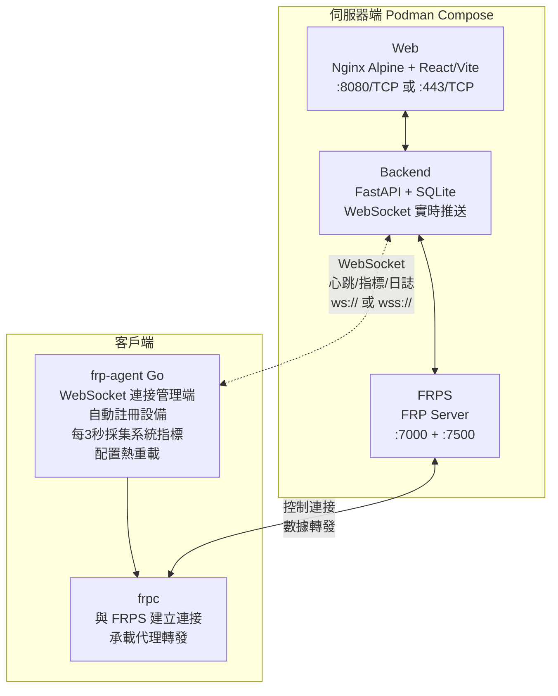

<div align="center">
  <h1>FRP-ALL-IN-ONE</h1>
  <p>一個基於 Web 的 FRP 內網穿透管理系統：用瀏覽器完成 <b>FRPS 配置</b>、<b>客戶端一鍵部署</b>、<b>設備註冊/心跳</b>、<b>端口映射管理</b>，並提供<b>實時流量監控</b>與<b>系統資源監控</b>。</p>
  <p><b>極致輕量 · 開箱即用 · 功能強大</b></p>
  <p>
    <a href="https://github.com/GreenhandTan/FRP-ALL-IN-ONE/stargazers"></a>
    <a href="LICENSE"></a>
    
    
    
    
  </p>
  <p>
    <a href="#highlights">核心優勢</a> ·
    <a href="#features">功能特性</a> ·
    <a href="#quick-start-server">部署指南</a> ·
    <a href="#ports">端口放行</a> ·
    <a href="#troubleshooting">排障</a> ·
    <a href="#license">開源協議</a>
  </p>
  <p>
    <a href="README.md">简体中文</a> |
    <a href="README.en.md">English</a> |
    <a href="README.zh-TW.md">繁體中文</a>
  </p>
</div>

> [!CAUTION]
> **升級提示（V2.5.0-beta）**：本次為重大架構升級 + 前端 UI 重構 + 安全加固，**建議舊版本用戶直接重新部署**，詳見 [升級指南](#upgrade)。

<a id="author"></a>

## 作者與社區

- 部落格：https://greenhandtan.top

<a id="stars"></a>

## Star History

[](https://www.star-history.com/#GreenhandTan/FRP-ALL-IN-ONE&type=date&legend=top-left)

<a id="demo"></a>

## 效果演示


<br/><br/>

<br/><br/>

<br/><br/>

<br/><br/>


<a id="toc"></a>

## 目錄

- [核心優勢](#highlights)
- [核心特性](#features)
- [架構說明](#architecture)
- [快速開始（伺服器端）](#quick-start-server)
- [升級指南](#upgrade)
- [首次使用流程](#first-time-workflow)
- [HTTPS 配置（可選）](#https-setup)
- [NAT 訪問端口配置（可選）](#nat-port-setup)
- [飛牛 OS 客戶端部署說明](#fnos-client)
- [端口與安全組](#ports)
- [監控與統計說明](#monitoring)
- [常用運維命令](#ops)
- [排障指南](#troubleshooting)
- [卸載客戶端](#uninstall)
- [項目結構](#layout)
- [開發與構建](#development)
- [開源協議與使用要求](#license)

<a id="highlights"></a>

## 核心優勢

### 極致輕量

- **1核1G 伺服器即可流暢運行**：經過實際測試，最低配置（1 vCPU + 1 GB RAM）的雲伺服器完全滿足系統部署與運行需求
- **前端現代化技術棧**：React 19 + TypeScript + Vite + Tailwind CSS，類型安全、構建高效、樣式優雅
- **輕量後端技術棧**：FastAPI + SQLite，無需 MySQL/PostgreSQL，資料檔案僅數 MB，極低磁碟與記憶體占用
- **容器極度精簡**：Nginx Alpine 鏡像 + 純靜態檔案，Web 容器記憶體占用 < 10 MB

> **實例：超低配 LXC 伺服器實測**  
> 透過「**本地構建 + 雲端導入**」的特殊部署手法（在本地構建好專案映像後匯入雲伺服器，繞過記憶體不足的構建限制），本專案可在 **1核 256MB 記憶體 + 2G 資料盤** 的 LXC 架構雲伺服器上流暢運行，實現完整的內網穿透集中管理。作者實測機器售價僅 **¥29.9 / 三年**，極具性價比。詳細部署思路請參見：[作者博客 Blog#25](https://greenhandtan.top/blog/25)

### 開箱即用

- **一條指令完成全部部署**：`git clone` + 執行 `deploy.sh`，自動處理依賴安裝、容器構建、服務啟動
- **可視化配置嚮導**：首次登入後透過 Web 介面嚮導完成 FRPS 配置（IP/網域模式可選），無需手動編輯任何配置檔案
- **客戶端腳本自動生成**：在控制台一鍵生成針對不同平台（Linux/macOS/Windows）、不同架構（x86/ARM/MIPS）的部署腳本，複製後直接在內網機器執行
- **NAT 穿透相容**：支援在 NAT 環境下顯式配置管理面板公網訪問端口（如 `公網IP:10967 → 內網80`），生成的客戶端腳本自動使用正確地址

### 功能強大

- **WebSocket 即時推送**：每 3 秒推送全局狀態，每個客戶端的 CPU/記憶體/磁碟/網路指標即時可見，無需手動刷新
- **配置熱重載**：透過 FRPC Admin API 動態增刪端口映射，通道變更立即生效，無需重啟 frpc 處理程序
- **HTTPS 全自動**：網域模式下一鍵申請 Let's Encrypt 憑證並自動續期（到期前 30 天）
- **多架構 Agent**：Go 編寫的 frp-agent 支持 x86_64 / ARM64 / ARMv7 / MIPS，涵蓋樹莓派、路由器等各類設備
- **完善的安全機制**：GitHub OAuth 認證、JWT 鑑權、API 限流、邀請制訪問控制、Nginx 安全響應頭，生產級別安全保障

---

<a id="features"></a>

## 核心特性

### 部署與管理

- **一鍵部署**：Podman Compose 啟動管理後台、Web、FRPS
- **配置嚮導**：Web 介面完成 FRPS 端口、Token、公網 IP 設置
- **一鍵腳本**：自動生成客戶端部署腳本（支持多架構、systemd / OpenRC / launchd、開機自啟）
- **HTTPS 全自動**：一鍵申請 Let's Encrypt 憑證並自動續期
- **NAT 端口配置**：支援 NAT 雲伺服器顯式指定管理面板公網端口，腳本生成自動感知

### 安全增強

- **GitHub OAuth 認證**：使用 GitHub 帳號登入，系統不綁定任何憑據，用戶自行提供 OAuth App 資訊
- **邀請制訪問控制**：首個登入用戶自動成為超級管理員，後續用戶需被邀請才能訪問
- **管理員管理**：超級管理員可在控制台邀請/移除 GitHub 用戶，管理管理員列表
- **高階 JWT 保護**：基於記憶體的無狀態 Ephemeral JWT Keys（防資料庫脫庫），支援環境變數 `SECRET_KEY` 注入多節點
- **網路隔離防禦**：將後端管理端口嚴格綁定至 127.0.0.1，防公網直連繞過 Nginx，並具備強正則校驗阻斷 Nginx 配置注入
- **API 限流**：登入 5次/分鐘，證書申請 3次/小時，防止暴力破解
- **安全響應頭**：Nginx 配置 `X-Content-Type-Options`、`X-Frame-Options`、`Referrer-Policy` 等安全頭
- **證書智能化管理**：Let's Encrypt 證書自動續期（後台 Python 非同步守護任務），支援控制台查看證書剩餘時間與一鍵手動續期

### 實時監控

- **實時流量監控**：Agent 每 3 秒採集網路流量速率，WebSocket 實時推送
- **系統資源監控**：CPU、記憶體、磁碟使用率實時顯示
- **累計流量統計**：頂部卡片展示所有客戶端的累計總流量
- **隧道流量統計**：每個隧道獨立顯示累計流量

### Agent 機制

- **自動註冊**：客戶端自動上報 hostname、OS、架構，自動命名設備
- **心跳上報**：定時上報系統指標（CPU、記憶體、磁碟、網路速率）
- **配置熱重載**：通過 FRPC Admin API 熱重載配置，無需重啟服務
- **實時日誌**：WebSocket 推送 FRPC 運行日誌到控制台
- **協議自適應**：Agent 自動偵測服務器協議（ws/wss）並切換

### 其他特性

- **WebSocket 實時推送**：每 3 秒推送狀態更新，無需手動刷新
- **國際化**：支持簡體中文/英文/繁體中文三語切換
- **現代化前端**：React + TypeScript + Vite 構建，TypeScript 類型安全，Vite 秒級熱更新
- **資料持久化**：SQLite 資料庫和憑證自動持久化到 Podman 卷

<a id="architecture"></a>

## 架構說明


```mermaid
flowchart TB
    subgraph Server["伺服器端 Podman Compose"]
        Web["Web<br/>Nginx Alpine + React/Vite<br/>:8080/TCP 或 :443/TCP"]
        Backend["Backend<br/>FastAPI + SQLite<br/>WebSocket 實時推送"]
        FRPS["FRPS<br/>FRP Server<br/>:7000 + :7500"]
        Web <--> Backend
        Backend <--> FRPS
    end

    subgraph Client["客戶端"]
        Agent["frp-agent Go<br/>WebSocket 連接管理端<br/>自動註冊設備<br/>每3秒採集系統指標<br/>配置熱重載"]
        FRPC["frpc<br/>與 FRPS 建立連接<br/>承載代理轉發"]
        Agent --> FRPC
    end

    Backend <-.->|"WebSocket<br/>心跳/指標/日誌<br/>ws:// 或 wss://"| Agent
    FRPS <-->|"控制連接<br/>數據轉發"| FRPC
```

<a id="quick-start-server"></a>

## 快速開始（伺服器端）

### 前置要求

- 一台具備公網 IP 的伺服器（**建議 Linux 系統，最低 1核1G 即可流暢運行**，實測驗證）
- Podman & Podman Compose（可由部署腳本自動安裝）
- 端口放行（至少）：8080/TCP、FRPS 端口（預設 7000/TCP）
- 一個 GitHub 帳號（用於登入和建立 OAuth App）

> **系統建議**：本項目基於 Podman 部署，部署腳本會自動識別 Linux 發行版（含 Alpine、Debian/Ubuntu、RHEL 系）並安裝依賴。

> **輕量提示**：前端為 React 構建的靜態檔案，Nginx 容器記憶體占用 < 10 MB；後端 FastAPI + SQLite，整套系統在 1核1G 機器上運行绰绰有餘。

### 建立 GitHub OAuth App（必須）

本系統使用 GitHub OAuth 進行登入驗證，你需要建立自己的 GitHub OAuth App：

1. 開啟 https://github.com/settings/developers
2. 點擊 **New OAuth App**
3. 填寫資訊：
   - **Application name**：`FRP Manager`（或任意名稱）
   - **Homepage URL**：`http://<你的伺服器IP>:8080`（或你的網域）
   - **Authorization callback URL**：`http://<你的伺服器IP>:8080/api/auth/github/callback`
4. 點擊 **Register application**
5. 複製 **Client ID**
6. 點擊 **Generate a new client secret**，複製 **Client Secret**

然後在部署前設定環境變數：

```bash
export GITHUB_CLIENT_ID="你的Client ID"
export GITHUB_CLIENT_SECRET="你的Client Secret"
```

也可以在 `compose.yml` 同目錄下建立 `.env` 檔案：

```env
GITHUB_CLIENT_ID=你的Client ID
GITHUB_CLIENT_SECRET=你的Client Secret
```

> **安全說明**：系統不內建任何 GitHub 憑據，每個使用者必須提供自己的 OAuth App 資訊。

### 一鍵部署

```bash
git clone https://github.com/GreenhandTan/FRP-ALL-IN-ONE.git
cd FRP-ALL-IN-ONE/deploy

chmod +x deploy.sh
sudo ./deploy.sh
```

### 首次登入

部署完成後，訪問 `http://<伺服器IP>:8080`，點擊 **Sign in with GitHub** 按鈕。

**首個登入的 GitHub 使用者將自動成為超級管理員**，之後只有被邀請的 GitHub 使用者才能登入。

超級管理員可以在控制台的「管理員管理」中邀請其他 GitHub 使用者。

### 低記憶體伺服器（512MB 或更低）

如伺服器記憶體低於 1 GB，建議先開啟 Swap 再部署：

```bash
cd FRP-ALL-IN-ONE/deploy
chmod +x setup-swap.sh
sudo ./setup-swap.sh   # 建立 2GB Swap
sudo ./deploy.sh
```

> 1核1G 的伺服器通常無需開啟 Swap 即可直接部署。

### 數據持久化

當前 `compose.yml` 已預設啟用數據持久化：

- `frp-data`：FRP 配置文件持久化
- `frp-certs`：SSL 證書持久化
- `./data`：SQLite 資料庫持久化

<a id="upgrade"></a>

## 升級指南

> [!CAUTION]
> **V2.5.0-beta 為重大架構升級**（GitHub OAuth 登入 + 前端 UI 全面重構 + 安全加固），資料庫結構和前端程式碼均有不相容變更。**建議直接重新部署**，無需手動執行資料庫遷移。

### 重新部署（推薦）

```bash
cd FRP-ALL-IN-ONE/deploy
podman compose -f compose.yml down
cd ..
mv deploy/data deploy/data.bak   # 備份舊資料（可選）
git pull
cd deploy
sudo ./deploy.sh
```

> 如需保留舊資料，備份 `deploy/data` 目錄後重新部署即可。首個登入的 GitHub 用戶將自動成為超級管理員。

<a id="first-time-workflow"></a>

## 首次使用流程

### 1) 登入管理台

訪問：`http://<伺服器公網IP>:8080`，點擊 **Sign in with GitHub**，使用你的 GitHub 帳號登入。

**首個登入的 GitHub 用戶將自動成為超級管理員**，之後只有被邀請的 GitHub 用戶才能登入。超級管理員可在控制台的「管理員管理」中邀請其他 GitHub 用戶。

### 2) 配置 FRPS（嚮導）

在嚮導中設置：

- 監聽端口（預設 7000）
- 公網 IP（支持自動探測）

### 3) 部署客戶端

在嚮導「客戶端腳本」頁面下載腳本，在內網機器執行：

```bash
chmod +x deploy-frpc.sh
sudo ./deploy-frpc.sh
```

### 4) 創建端口映射

在控制台「設備列表」中：

1. 選擇設備 → 新增映射（TCP/UDP/HTTP/HTTPS）
2. 等待 Agent 同步並熱重載
3. 通過 `公網IP:remote_port` 訪問內網服務

<a id="https-setup"></a>

## HTTPS 配置（可選）

1. 進入「系統設置 → 域名與 HTTPS」
2. 輸入你的域名（如 `frp.example.com`）
3. 按提示將域名 A 記錄解析到伺服器公網 IP
4. 點擊「檢測 DNS」驗證解析是否正確
5. 點擊「啟用 HTTPS」，系統將自動：
   - 臨時監聽 80 端口並重載 Nginx
   - 啟動 acme.sh 並以獨立模式在 90 端口挑戰驗證（由 Nginx 80 轉發）
   - 申請 Let's Encrypt 證書
   - 覆寫並部署正式 Nginx HTTPS 配置
   - 重載服務
6. 完成後自動跳轉到 `https://你的域名`

> **自動續期**：證書將在過期前 30 天由後台 Python 守護線程定時（每24小時）自動續期，無需手動干預。
> 
> **注意**：由於證書驗證（HTTP-01 挑戰）必須透過公網 80 端口，請確保伺服器的 **80 端口** 在安全組/防火牆中已對公網放行。

<a id="nat-port-setup"></a>

## NAT 訪問端口配置（可選）

> **適用場景**：你的雲伺服器不是直接使用公網 IP 部署，而是透過 NAT 端口映射訪問，例如：
> `公網 151.242.85.89:10967` → 內網 `伺服器:8080`（管理面板走 NAT 映射）

在這種場景下，如果不做額外配置，系統生成的客戶端安裝腳本中會使用預設端口（預設 `8080`，若啟用了 HTTPS 則為 `443`），導致 Agent 無法連接到管理面板（需使用 NAT 映射的公網端口）。

### 配置方式

1. 登入管理控制台，點擊右上角**齒輪圖示**（⚙）
2. 在「管理面板公網訪問端口」一欄填寫 NAT 映射的公網端口（如 `10967`）
3. 點擊「儲存」

配置儲存後，之後生成的所有客戶端安裝腳本將自动使用：

```
ws://151.242.85.89:10967/ws/agent/<CLIENT_ID>
```

### 地址解析優先級

腳本生成時 `MANAGER_WS_URL` 的地址按以下優先級確定：

| 優先級 | 條件                             | 使用的地址                 |
| ------ | -------------------------------- | -------------------------- |
| ① 最高 | 已通過設定頁面配置 NAT 端口      | 若開啟 HTTPS: `wss://網域:NAT端口`<br/>否則: `ws://公網IP:NAT端口` |
| ②      | 瀏覽器請求攜帶 Host 頭（含端口） | `ws://Host頭中的host:port` |
| ③      | 已啟用 HTTPS + 配置網域          | `wss://網域`               |
| ④ 底層 | 其餘情況                         | `ws://公網IP:8080` (若開啟 HTTPS 則為 `wss://網域:443`) |

> **普通雲伺服器**：無需任何配置，留空即可，系統自動使用公網 IP。

<a id="fnos-client"></a>

## 飛牛 OS 客戶端部署說明

可以，但需要區分「Agent 能運行」和「目前的一鍵腳本能直接運行」這兩件事。

- **可以作為客戶端部署**：飛牛 OS 本質上仍是 Linux 環境，只要設備架構是 `x86_64` 或 `arm64`，理論上即可運行本項目的 Linux Agent。
- **目前一鍵腳本相容多種 init 系統**：自動偵測 systemd（主流發行版）、OpenRC（Alpine 等），無 init 系統時自動降級為 nohup 背景運行。
- **若飛牛 OS 提供標準 Linux 使用者空間**：通常可以直接使用控制台生成的 Linux 客戶端腳本安裝。
- **若飛牛 OS 不帶 systemd/OpenRC 或限制系統服務**：腳本會自動降級為 nohup 背景運行模式，Agent 與 frpc 仍可正常運作。

建議先在飛牛 OS 上檢查以下命令：

```bash
uname -m
command -v systemctl || command -v rc-update
command -v curl
command -v wget
test -w /opt || sudo test -w /opt
```

判定原則：

- 輸出為 `x86_64` 或 `aarch64`：架構符合。
- 存在 `systemctl` 或 `rc-update`，且 `/opt` 可寫：可直接使用目前腳本。
- 兩者都不存在：腳本會自動降級為 nohup 背景運行，仍可正常使用。

<a id="ports"></a>

## 端口與安全組

| 端口                      | 協議    | 用途                        |
| ------------------------- | ------- | --------------------------- |
| 8080                      | TCP     | Web 管理介面（HTTP 預設端口，啟用 HTTPS 前必選） |
| 80                        | TCP     | HTTP 自動跳轉及 HTTPS 憑證挑戰驗證（啟用 HTTPS 時必選） |
| 443                       | TCP     | Web 管理介面（HTTPS 端口，可選） |
| 7000（或自定義 bindPort） | TCP     | frpc 控制連接               |
| 49152-65535               | TCP/UDP | 推薦的私有端口範圍          |

> 每個 `remote_port` 都需要在安全組中放行才能從外部訪問。

<a id="monitoring"></a>

## 監控與統計說明

### 數據刷新頻率

| 環節                 | 刷新頻率                   |
| -------------------- | -------------------------- |
| Agent 系統指標採集   | 每 3 秒                    |
| WebSocket 推送到前端 | 每 3 秒（隨 Agent 採集）   |
| 前端即時速率更新     | 每次訊息到達立即刷新       |
| 前端 CPU/記憶體/磁碟 | 每 3 次訊息刷新一次        |
| FRPS 狀態快取刷新    | 每 10 秒                   |
| 憑證續期檢查         | 每 24 小時                 |

### 流量統計口徑

| 指標                        | 說明                                              |
| --------------------------- | ------------------------------------------------- |
| 頂部「總流量」              | 所有客戶端的機器級別累計流量（包含所有網路流量）  |
| 客戶端卡片「傳入/傳出流量」 | 該客戶端的實時網路速率（B/s、KB/s、MB/s）         |
| 隧道「總流量」              | 該隧道的累計流量（來自 FRPS API，連接關閉後更新） |

### 在線狀態判斷

- Agent 心跳 `last_seen` 在 30 秒內視為在線
- WebSocket 連接狀態實時顯示

<a id="ops"></a>

## 常用運維命令

### 伺服器端（Podman）

```bash
cd FRP-ALL-IN-ONE/deploy

# 查看狀態
podman compose -f compose.yml ps
podman compose -f compose.yml logs -f

# 重啟服務
podman compose -f compose.yml restart
podman restart frps

# 更新到最新版本（從 TCR 拉取預構建鏡像）
podman compose -f compose.yml down
podman compose -f compose.yml pull
podman compose -f compose.yml up -d

# 查看證書續期日誌
podman exec frp-manager-backend cat /var/log/acme.cron.log
```

### 客戶端

**Linux (systemd)**：

```bash
systemctl status frp-agent --no-pager
journalctl -u frp-agent -n 200 --no-pager
```

**Linux (OpenRC / Alpine)**：

```bash
rc-service frp-agent status
cat /opt/frp/logs/*.log
```

**macOS (launchd)**：

```bash
launchctl list | grep frp-agent
cat /opt/frp/logs/*.log
```

<a id="troubleshooting"></a>

## 排障指南

### 端口映射創建了但訪問不了

1. **檢查外網連通性**（在非伺服器本機測試）

   ```bash
   nc -vz <公網IP> <remote_port>
   ```

2. **檢查安全組/防火牆**：確認端口已放行

3. **檢查 FRPS 是否監聽**

   ```bash
   ss -lntp | grep :<remote_port>
   podman logs frps --tail 200
   ```

4. **檢查客戶端配置同步**
   ```bash
   grep -n "<remote_port>" /opt/frp/frpc.toml
   journalctl -u frp-agent -n 200 --no-pager
   ```

### 設備無法註冊/不顯示

```bash
systemctl status frp-agent --no-pager
cat /opt/frp/agent.json
```

確認 Agent 服務正常運行且能連接到管理端。

### HTTPS 證書申請失敗

1. **檢查 DNS 解析**：確保域名 A 記錄已正確指向伺服器公網 IP
2. **檢查端口 8080**：Let's Encrypt 驗證需要使用 8080 端口
3. **查看日誌**：`podman logs frp-manager-backend | grep -i "cert\|acme"`
4. **手動觸發續期**：在 Web 介面點擊「續期證書」按鈕

<a id="uninstall"></a>

## 卸載客戶端

```bash
cd FRP-ALL-IN-ONE/deploy
chmod +x uninstall-frpc.sh
sudo ./uninstall-frpc.sh
```

<a id="layout"></a>

## 項目結構

```
FRP-ALL-IN-ONE/
├── frontend/               # Web 介面（React + TypeScript + Vite + Tailwind CSS）
│   ├── src/
│   │   ├── App.tsx         # 主應用組件（路由、頁面、狀態管理）
│   │   ├── api.ts          # HTTP API 模組（對接後端 REST API）
│   │   ├── ws.ts           # WebSocket 模組（即時資料推送）
│   │   ├── types.ts        # TypeScript 類型定義
│   │   ├── data.ts         # 靜態資料與腳本生成
│   │   └── index.css       # 全域樣式（Tailwind CSS）
│   ├── Dockerfile          # 多階段構建：Node 編譯 + Nginx 部署
│   ├── package.json
│   └── vite.config.ts
├── server/                # 後端 API（FastAPI + SQLite）
│   ├── main.py             # 應用入口，WebSocket 端點
│   ├── auth.py             # JWT 認證與 GitHub OAuth
│   ├── models.py           # 資料庫模型
│   ├── schemas.py          # Pydantic 資料校驗
│   ├── crud.py             # 資料庫增刪改查
│   ├── database.py         # SQLite 資料庫連接
│   ├── frp_deploy.py       # FRPS 部署與配置生成
│   ├── websocket_manager.py # WebSocket 連接管理器
│   ├── core/               # 核心基礎設施
│   │   ├── dependencies.py    # 依賴注入（認證、資料庫）
│   │   ├── container_engine.py # Podman 容器引擎
│   │   ├── rate_limit.py      # API 限流
│   │   └── exceptions.py      # 統一異常處理
│   ├── routers/            # API 路由
│   │   ├── auth.py            # 認證（GitHub OAuth、管理員管理）
│   │   ├── clients.py         # 客戶端、隧道管理
│   │   ├── agents.py          # Agent 管理、指標查詢
│   │   ├── frp_server.py      # FRPS 管理、安裝腳本
│   │   ├── system.py          # 系統狀態
│   │   └── settings.py        # 域名與 HTTPS 設置
│   └── services/           # 業務邏輯層
│       ├── dashboard.py       # Dashboard 資料聚合
│       ├── tls_manager.py     # 證書申請、Nginx 配置
│       └── dns_checker.py     # DNS 解析驗證
├── agent/                  # 設備端 Agent（Go 語言）
│   ├── cmd/frp-agent/      # 主程式入口
│   ├── internal/           # 內部模組
│   │   ├── config/         #   配置管理
│   │   ├── frpc/           #   FRPC 進程管理
│   │   ├── monitor/        #   系統監控（CPU/記憶體/磁碟/網路）
│   │   ├── ws/             #   WebSocket 客戶端
│   │   └── logger/         #   日誌採集
│   ├── scripts/            # 安裝腳本範本
│   ├── go.mod
│   └── Makefile
├── deploy/                 # 部署腳本 & compose
│   ├── compose.yml         # Podman Compose（3 個容器）
│   ├── deploy.sh           # 一鍵部署腳本
│   ├── frps.toml           # FRPS 配置範本
│   ├── setup-swap.sh       # Swap/zram 建立腳本
│   └── uninstall-frpc.sh   # Agent 卸載腳本
├── .github/workflows/      # CI/CD
│   ├── build-and-push.yml  #   構建推送 Docker 鏡像到 TCR
│   └── release-agent.yml   #   編譯發布 Agent 到 GitHub Releases
├── demo1.png               # 演示截圖 1
├── demo2.png               # 演示截圖 2
├── demo3.png               # 演示截圖 3
├── demo4.png               # 演示截圖 4
└── demo5.png               # 演示截圖 5
```

<a id="development"></a>

## 開發與構建

### 前端

前端基於 React + TypeScript + Vite + Tailwind CSS，需 Node.js 環境：

```bash
cd frontend
npm install
npm run dev     # 啟動開發伺服器 http://localhost:3000
npm run build   # 構建生產版本到 dist/
npm run lint    # TypeScript 類型檢查
```

### Agent

```bash
cd agent
make dev            # 構建當前平台
make all            # 構建所有平台（產物在 dist/ 目錄）
```

Linux 平台使用 `CGO_ENABLED=0` 編譯靜態連結二進制，相容 Alpine (musl) 和普通發行版 (glibc)：

```bash
# Linux ARM64（樹莓派等）
CGO_ENABLED=0 GOOS=linux GOARCH=arm64 go build -o frp-agent-linux-arm64 ./cmd/frp-agent
# Linux x86_64
CGO_ENABLED=0 GOOS=linux GOARCH=amd64 go build -o frp-agent-linux-amd64 ./cmd/frp-agent
```

### 後端

後端以 Podman 方式運行最穩定；如需本地運行：

```bash
cd server
pip install -r requirements.txt
python -m uvicorn main:app --reload
```

<a id="license"></a>

## 開源協議與使用要求

本項目採用 **MIT License**（見 [LICENSE](LICENSE)）。

你可以：

- 免費使用（個人/組織）
- 免費商用
- 修改、二次開發、分發

你需要遵守：

- 保留許可證與版權聲明
- 註明原作者為 **GreenhandTan**

## 安全建議

- 及時邀請可信的 GitHub 用戶，移除不再需要的管理員
- 每次重新部署會自動重新生成 `SECRET_KEY`，舊登入會話立即失效
- 定期更新 Podman 鏡像（宿主機 Podman 版本需 >= 4.0，部署腳本會自動檢查）
- 安全組僅開放必要端口
- FRPS Dashboard（7500）建議僅允許本機訪問
- 啟用 HTTPS 以加密通信（推薦生產環境使用）

## 致謝

- [FRP](https://github.com/fatedier/frp) - 優秀的內網穿透工具
- [gopsutil](https://github.com/shirou/gopsutil) - Go 系統監控庫
- [acme.sh](https://github.com/acmesh-official/acme.sh) - 全功能 Let's Encrypt 客戶端

---

如果這個項目對您有幫助，歡迎給我們一個 Star。
